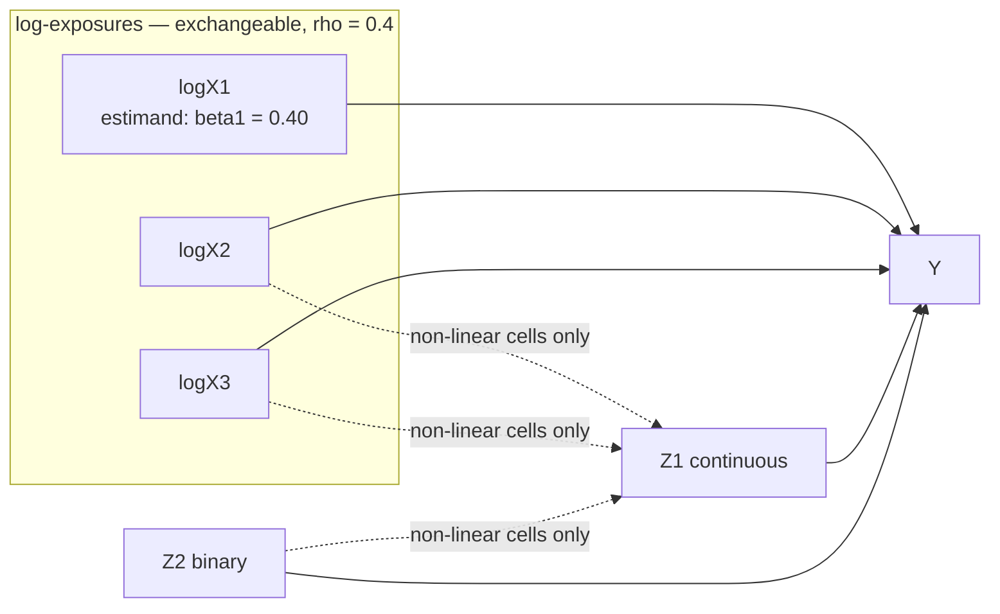

# Validation plan: the *shipped* censored-exposure pipeline

**Status:** draft, 2026-08-25. Companion to
[`PLAN_leftcensored_exposure_integration.md`](PLAN_leftcensored_exposure_integration.md)
(the design/theory document) and [`phase1/FINDINGS.md`](phase1/FINDINGS.md) (the
Monte-Carlo results that motivated the build).

---

## 1. Why a separate plan

The existing plan is a *design* document: it argued the case for congenial
imputation of a censored exposure, gated the build behind a Monte-Carlo study, and
tracked the build itself through Phases 1–4. That plan has done its job — the
mechanism is demonstrated and the engine is written.

This plan covers what is left, which is a different question:

> The bias numbers we have validate a **prototype**. Do they hold for the **code we
> ship**?

Every headline result in `FINDINGS.md` comes from `cens_mi_y_shash`, a ~40-line
reference procedure inside the MC harness. The pipeline path that users will actually
run — `run_censored_exposure_block_fcs()` in
[`00_censored_exposure.R`](../00_censored_exposure.R) — has been shown to *run*
(end-to-end example, Steps 1→4) and was spot-checked by a one-off 25-replication
synthetic MC that lives nowhere in the repo. That is not the same evidence, and the
gap is the main thing this plan closes.

### Scope boundary

| In scope | Out of scope |
|---|---|
| Validating shipped pipeline code against known truth | Re-litigating the design (settled in the other plan) |
| Making the mixture verdict rest on real estimands | Building a substantive-model-compatible mixture engine |
| Documenting the required `m` | Production runs on real cohort data |
| Robustness axes not yet swept | `leftcens` package-internal validation (lives in that repo) |

---

## 2. Status snapshot

**Validated (prototype-level), from `FINDINGS.md` — 300 reps/cell, `n`=800, `M`=30:**

- H1 confirmed on the additive DGP: the no-`Y` pre-step attenuates the focal
  coefficient (−5.6% at 20% ND → −14.4% at 40% ND; coverage 0.92 → 0.82), and the
  congenial `Y`-aware method removes it (bias ≤0.4%, coverage ~0.96).
- H3 confirmed: complete-case ~unbiased for the slope, inefficient (rmse up to ~4.5×
  oracle).
- §7.7 gap material for mixtures: linear congenial imputation is itself biased on the
  mixture surface (+7.7% → +19.6%, coverage → 0.62).
- §7.5 skew: the reference must be skew-aware; a Gaussian/tobit `Y`-aware reference
  breaks under right-skew (coverage → 0.47), the shash margin restores it.
- Scale resolved: the X-block draw is ~`k²` in predictor width, not `n`; ~1.6–2.4 min
  at `k` ≤ 50 for 20 datasets × 5 sweeps at `n` = 80k.

**Not validated:**

| Gap | Consequence if left open |
|---|---|
| ~~Shipped `run_censored_exposure_block_fcs()` never MC-tested~~ | **CLOSED 2026-08-25 (V1)** — see `phase1/FINDINGS_v1.md` |
| ~~Steps 5–11 + Quarto never run on the censored path~~ | **CLOSED 2026-08-25 (V0)** |
| Mixture verdict rests on a single local coefficient | The §7.7 claim is not manuscript-final |
| No FMI / pilot-`m` figure for this path | Users have no principled `m` |
| ~~Robustness axes unswept~~ | **CLOSED 2026-08-25 (V2)** — 9/10 pass; one under-coverage finding open |
| ~~NEW: interval under-coverage under heavy covariate + outcome missingness~~ | **ATTRIBUTED 2026-08-25 (V4)** — improper MI in the miceRanger Z block understates `B`; affects the general imputation path, not just this feature |
| **OPEN: the Z block needs a proper draw** | Until fixed, intervals are too narrow wherever much is imputed. The V4 instrument is not the fix (overshoots) |

---

## 3. Working agreement

Per the arrangement for this project:

- **Claude writes the scripts.** Each track below produces files that are reviewed
  before anything is run.
- **The user runs them** on this machine, and pastes back the summary table or points
  at the results file.
- **We evaluate together** against the acceptance criteria stated per track — written
  *before* the run, so the read-out is not post-hoc.
- Findings land in `FINDINGS.md` (or a per-track findings file) with the same
  conventions as Phase 1: env-var config, sourceable functions, git-ignored `results/`.

Nothing in this plan should silently change pipeline behaviour. Where a track
uncovers a bug, the fix is a separate, reviewed change.

---

## 4. Environment (verified 2026-08-25)

```
leftcens    0.9.0   (tag v0.9.0 -> b3ebc8c, pushed)
brms        2.23.0
cmdstanr    0.9.0.9000  (CmdStan 2.38.0)
miceRanger  1.5.0
survival    3.8.11
future      1.75.0 / furrr 0.4.0
bkmr        0.2.2   (+ bkmrhat 1.1.7, aBKMR 0.1.0)  <- track V3 only
fields      17.3    (GPP knots via cover.design)
cores       24
```

`NCORES=14` is the Phase-1 default and leaves headroom; with 24 cores, `NCORES=20`
is reasonable for the fork-parallel tracks. Keep BLAS single-threaded
(`run_phase1.sh` already exports the four `*_NUM_THREADS=1` variables) so it does not
fight the R-level loop.

---

## 5. Track V0 — Full-pipeline regression on the censored example

> **STATUS: PASSED — 2026-08-25**, ~78 s. All five criteria met: clean exit, populated
> `parameter_summary.csv`, Step 11 outputs, report rendered (HTML + DOCX), Step 12
> skipped cleanly. Steps 09/10 correctly omitted (no `mo()` terms), MID dropped 30
> imputed-`Y` rows per dataset, 0 divergences and 0 treedepth hits across 5 fits.
> Confirmed the `12_export_draws.R` harness fix — Step 12 now runs at all.

**Question:** do Steps 5–11 and the Quarto report work on the censored-exposure path?

Steps 1→4 are verified; 5–11 are generic but have never been exercised here. A
harness bug that aborted *every* `test/` run at Step 12 was fixed on 2026-08-25
(`12_export_draws.R` was missing from the copied file list), so this is the first run
that can complete.

**New code:** none. The script already exists.

**Run:**

```bash
bash test/test_censored_exposure_quick.sh
```

**Expected:** ~15–30 min at quick settings (`m`=5, chains=1). Output lands in
`test/runs/<timestamp>_censored_exposure/project/`.

**Acceptance criteria:**

1. Exit status 0 and no `pipeline_error.flag`.
2. `results/parameter_summary.csv` exists and contains `log(expo1)` / `log(expo2)`
   rows with finite estimates and CIs.
3. Step 11 stability outputs exist.
4. The combined Quarto report renders (HTML + DOCX) and its stability chapter is
   populated.
5. Step 12 is *skipped cleanly* (`export$cohort_id` is NULL) rather than erroring.

**What we evaluate together:** any step that errors or produces empty output; whether
the `mo()` chapter is correctly omitted; whether the pooled coefficients are sane
against the example's known generating values.

**Gate:** V0 must pass before V1 is worth running — V1 reuses the same imputation
engine, and a Steps 5–11 failure here is a pipeline bug, not a statistical one.

---

## 6. Track V1 — Procedure 5: the shipped engine in the MC harness

> **STATUS: PASSED — 2026-08-25.** 300 reps/cell, `m`=30, `n`=800, seed 20260825,
> ~17 min. Every pre-registered additive criterion met: rel. bias −0.79% (20% ND) and
> +0.48% (40% ND), coverage 0.957 at both, rmse 1.06×/1.24× oracle, and 0.0485 vs
> complete-case's 0.0719 at 40% ND. Paired agreement with the `cens_mi_y_shash`
> prototype is ≤0.14% of the estimand in every cell. Mixture cells reproduce the
> prototype's known §7.7 bias (+7.54% / +19.55%) rather than exceeding it —
> faithful implementation, not a defect. Also an independent replication of Phase 1's
> H1 on a fresh seed. Full table and reading:
> [`phase1/FINDINGS_v1.md`](phase1/FINDINGS_v1.md).
>
> *Correction applied during implementation:* the "force `n_cores = 1`" note below was
> based on a misreading. `run_phase1()`'s replication loop is **serial**, so there is
> no outer fork to nest inside; `n_cores` is passed through to the module's `mclapply`,
> which also exercises the shipped parallel path.

**The priority track.** Everything else is refinement; this one converts "the
prototype is unbiased" into "the shipped code is unbiased".

**Question:** does `run_censored_exposure_block_fcs()` recover the known
exposure–response coefficient with nominal coverage, on the same DGP, censoring, and
metrics as the existing four procedures?

### New files

```
validation/phase1/R/procedures_pipeline.R    # proc_pipeline_block_fcs() + adapters
validation/phase1/run_v1_pipeline.sh         # detached runner (mirrors run_phase1.sh)
```

plus small edits to `run_phase1.R` (registry) and `R/metrics.R` (see gotchas).

### Design

`proc_pipeline_block_fcs(bundle, m, seed)` must:

1. Adapt the harness bundle into the pipeline's input convention.
2. Call the **real** `run_censored_exposure_block_fcs()` — imported by sourcing
   `00_censored_exposure.R`, not copy-pasted.
3. Fit the matched ERF model to each of the `m` completed datasets with the harness's
   existing `fit_lm_estimand()`.
4. Pool with the harness's existing `rubin_pool()` and return `one_row(...)`.

Steps 3–4 deliberately reuse the harness helpers so the comparison against
`oracle` / `complete_case` / `leftcens_prestep` / `cens_mi_y_shash` is like-for-like:
the *only* thing that differs across procedures is the missing-data handling.

### Implementation gotchas (found while scoping — do not rediscover these)

1. **Scale mismatch.** The harness works in log space: `logX1` holds the true value
   and is `NA` on censored rows, with `logX1_lod` carrying the log LOD. The pipeline
   expects a **data-scale** exposure column plus `X_lo`/`X_hi` bounds. Adapter:

   | row | `X1` | `X1_lo` | `X1_hi` |
   |---|---|---|---|
   | observed | `exp(logX1)` | `exp(logX1)` | `exp(logX1)` |
   | censored | `NA` | `0` | `exp(logX1_lod)` |

   Set `censored_exposure$log_scale = TRUE` so the X block imputes on the log scale
   (where the shash margin lives), matching `cens_mi_y_shash`.

2. **`00_common_functions.R` is not standalone-sourceable.** It fails with
   `object 'paths' not found` — [line 1334](../00_common_functions.R:1334) reads
   `paths$objects` at top level for the runtime-override mechanism. Define stubs
   *before* sourcing:

   ```r
   paths <- list(objects = tempdir())
   analysis_spec <- list()
   source("00_common_functions.R")
   source("00_censored_exposure.R")
   ```

   (`log_msg()` works without `init_logging()`.)

3. **Nested forking.** `run_censored_exposure_block_fcs()` parallelises the `m`
   datasets with `mclapply`, and the harness already forks across replications via
   `NCORES`. Force `censored_exposure$n_cores = 1L` inside the procedure and
   parallelise only at the harness level — the same reasoning the module itself
   applies to its Z block.

4. **`metrics.R` will silently drop the new rows.** `summarise_phase1()` hardcodes
   `proc_order` as factor levels; a procedure name not in that vector becomes `NA`
   and sorts out of the table. Add `"pipeline_block_fcs"` to
   [`proc_order`](phase1/R/metrics.R:40).

5. **MID is a no-op as configured.** The harness's `Y` is fully observed, so
   `mid_delete_imputed_y` never fires. Exercising MID needs a `Y`-missingness factor —
   deferred to V4, and the procedure should assert MID did nothing rather than
   pretending it was tested.

6. **Synthetic `var_dict`.** The module reads `use_in_model`, `impute_target`, and
   `scale` from a dictionary data frame. Build a minimal one in the adapter with the
   exposures marked `impute_target = FALSE, use_in_model = TRUE`, matching what
   `01_validate_config.R` now enforces.

### Run

```bash
CONFIG=full NCORES=20 PROCS=oracle,complete_case,leftcens_prestep,cens_mi_y_shash,pipeline_block_fcs bash validation/phase1/run_v1_pipeline.sh
```

Start with a smoke pass (`CONFIG=quick N_REP=20`) to confirm the adapter before
committing to the full grid.

**Expected runtime:** the block-FCS runs `outer_sweeps` × (miceRanger + X-block) per
completed dataset, so it is the most expensive non-Stan procedure. Budget
significantly more than the ~5–8 min of the existing no-brms grid; the smoke pass
will give a per-rep timing to extrapolate from before the full run is launched.

### Acceptance criteria

Stated in advance. Monte-Carlo error at 300 reps with `emp_se` ≈ 0.04 on a true value
of 0.40 gives an MC standard error of ~0.6% on relative bias and ~±0.025 on coverage,
so these thresholds are ~5 MC SEs wide and are not measuring noise.

**Additive DGP (the case the gate said to build for) — this is a pass/fail:**

| Metric | Criterion |
|---|---|
| relative bias, ND 0.2 and 0.4 | \|rel_bias\| ≤ 3% |
| 95% interval coverage | 0.92 ≤ coverage ≤ 0.97 |
| rmse vs oracle | ≤ 1.3 × oracle rmse |
| rmse vs complete-case | strictly better at 40% ND |
| agreement with the prototype | within MC error of `cens_mi_y_shash` |
| `n_ok` | equals `n_rep` (no silent failures) |

**Mixture DGP — diagnostic, not pass/fail.** Phase 1 already established that *any*
linear congenial draw is biased here (+7.7% → +19.6%). The pipeline engine is a linear
draw, so it is expected to reproduce roughly that bias. The check is that it **tracks
`cens_mi_y_shash`** rather than being worse: agreement confirms the engine is a
faithful implementation, and the residual bias is the known §7.7 gap, not a coding
error. A pipeline result materially *worse* than the prototype on the mixture surface
would indicate an implementation bug.

**What we evaluate together:** the summary table row-by-row; any divergence from
`cens_mi_y_shash` beyond MC error; `n_ok` shortfalls and their `note` column; whether
the additive criteria are met at both ND levels.

**Outcome:** either a defensible bias/coverage claim for the shipped engine (which
goes into `README.md` and the manuscript), or a located bug.

---

## 7. Track V2 — Robustness sweep

> **STATUS: 9/10 PASSED, one finding — 2026-08-25.** 2750 tasks, 2.95 h, 63.7 CPU-h,
> zero failures, 98% worker efficiency. Bias passes everywhere (max 2.71%, bar 3%),
> including all exposures censored, n = 80 000, skew 0.75 and rho 0.8. **MID and the
> miceRanger Z block are now genuinely exercised** — both were dead code in V1.
> **Finding:** `combined` (all exposures censored + 20% MCAR covariates + 20% missing
> outcomes) has coverage **0.893**, below the 0.90 investigate line. It is a variance
> problem, not bias: interval width / empirical SE correlates 0.837 with coverage and
> falls to 0.84 exactly where the Z block does the most work, while the oracle stays
> calibrated (0.95–1.07) throughout. Leading hypothesis — miceRanger's RF/PMM draw is
> improper MI — is **not established**; a discriminating `m`=100 test is running.
> Full reading: [`phase1/FINDINGS_v2.md`](phase1/FINDINGS_v2.md).
>
> *Bug fixed during setup:* per-task seeds keyed on the scenario's index in the
> **filtered** list, so `SCENARIOS=` subsets silently generated different data than a
> full run. Now keyed on the canonical unfiltered position, which keeps subsets
> comparable to full runs and leaves the completed run reproducible.

**Question:** does the V1 result survive outside the single tested corner?

The Phase-1 caveats list four unswept axes. Each is a small change to the existing
generator/injector, and they can share one runner.

| Axis | Change | Why it matters |
|---|---|---|
| Censor **all** exposures | `inject_left_censoring(..., censor_which = seq_len(p))` | Real cohorts censor every analyte; the X block loops over exposures and that loop is untested under MC |
| MCAR covariates | `inject_mcar_covariates(..., mcar_frac = 0.2)` | Exercises the miceRanger Z block *and* the block-FCS alternation, currently a hook that has never been driven |
| Missing `Y` | new: MCAR a fraction of `Y` | The only way to exercise MID; asserts the imputed-`Y` rows are dropped and pooling is unaffected |
| Exposure correlation | vary `rho` (0.0 / 0.4 / 0.8) | High correlation is where the reduced predictor set could bite |
| Large `n` | one cell at `n` = 20k–80k, few reps | Confirms the scale test's timing at MC level |

**New files:** `validation/phase1/run_v2_robustness.R` + `.sh`, reusing V1's
procedure.

**Acceptance criteria:** the V1 additive criteria hold in every cell, with two
explicitly allowed degradations — coverage may drop toward 0.92 under heavy MCAR, and
rmse may rise with `rho`. Any cell where **bias** exceeds 3% or coverage falls below
0.90 is a finding to investigate, not a threshold to relax.

**Gate:** run only after V1 passes. A robustness sweep of a broken engine wastes core-hours.

---

## 7b. How tracks are designed from here: predict, then test

**Adopted 2026-09-01.** Tracks V0–V14 were *characterisation* runs: register an acceptance
threshold, run, describe what happened, explain it afterwards. That produced thirteen sound
findings and no theory, so each new result arrived as a surprise rather than as a test of
anything. [`THEORY.md`](THEORY.md) closed part of that gap retrospectively. From here the
loop runs forwards:

> **1. State the theory. 2. Derive a numeric prediction for an unmeasured cell.
> 3. Run. 4. The theory survives or is revised — and the revision is recorded.**

**What changes in practice.** A registered *acceptance criterion* asks "is the pipeline good
enough?" A registered *prediction* asks "is our understanding right?" — and can be wrong,
which is the point. A track designed this way states, before running:

- the mechanism it assumes,
- a **number** it expects in a cell nobody has measured,
- what result would **falsify** the mechanism, not merely disappoint it.

**Weak theory is allowed; pretending otherwise is not.** If the best available law is
frank curve-fitting, the prediction is registered as such and the run's job is to pin the
shape rather than to confirm anything. What is not allowed is presenting a fitted constant
as a derivation — the failure mode `THEORY.md` §4 already records three times.

**Predictions are kept even when wrong**, with the superseding result beside them, for the
same reason findings are corrected rather than overwritten: a wrong prediction that was
honestly registered is evidence about the theory, while a quietly deleted one is nothing.

---

## 8. Track V3 — Phase 2b: BKMR estimands

> **STATUS: RESOLVED — 2026-08-29.** 3 scenarios × 4 arms × 7 estimands × 200 reps,
> 600 tasks, 12.6 h, zero errors. **The mixture verdict holds and is worse than the scaffold
> showed**: the shipped engine is the worst of four arms, destroying 57% of the curvature at
> 40% non-detects — worse than LOD/√2 substitution. The gate failed as written on `curv_X1`
> (the 10% bar was mis-set from an underpowered 44-rep calibration); the run remains
> interpretable because the headline is paired excess over the oracle, in which the floor
> cancels. Full reading: [`phase1/FINDINGS_v3.md`](phase1/FINDINGS_v3.md).

**Question:** does the §7.7 mixture conclusion hold for the estimands that actually
matter, rather than the scaffold's single local coefficient?

This is the one item the existing plan explicitly flags as needed before the mixture
verdict is manuscript-final. It changes *what is measured*, not *what is compared*.

### The estimands, and their analytic truth

Seven contrasts on the generator's exposure surface, all evaluated at the **theoretical**
marginal quantiles rather than the empirical ones `bkmr::OverallRiskSummaries()` uses —
empirical quantiles move with `n` *and with the arm*, which would fold a data-dependent
shift into every comparison.

| estimand | definition | truth |
|---|---|---|
| `overall_q75_q50` | all exposures at q75 vs the median | `Σb·q75 + (b_int + b_quad)·q75²` |
| `overall_q25_q50` | all at q25 vs the median | mirror; the **asymmetry** against the row above is a pure curvature signature |
| `overall_q75_q25` | all at q75 vs all at q25 | `Σb·(q75−q25)` — **degenerate**, see below |
| `singvar_X1_q50` | X1 q75 vs q25, others at the median | `b₁(q75−q25)` |
| `singvar_X1_q75` | X1 q75 vs q25, others at q75 | adds `b_int·q75·(q75−q25)` |
| `int_X1X2` | (X1 effect with X2 high) − (X1 effect with X2 low) | `b_int·(q75−q25)²` — **pure interaction** |
| `curv_X1` | second difference of `h` in X1 | `b_quad·((q75−q50)² + (q25−q50)²)` — **pure curvature** |

**`overall_q75_q25` is degenerate on this generator and must not be read as "the mixture
estimand".** With `mu_x` = 0 the quantiles are symmetric, so the quadratic and interaction
terms cancel exactly and it collapses to a purely linear quantity — identical on the
mixture and additive generators. It is kept because the design plan names it, and because
an arm unbiased there but biased on `int_X1X2` localises the failure rather than merely
showing one. **`int_X1X2` and `curv_X1` are the sharp tests**: their truths contain nothing
but `b_int` and `b_quad`, the two parameters a linear imputation conditional cannot
represent.

Truth is computed as `C %*% h_true(Z)` — a contrast matrix applied to the exact generator
surface — and cross-checked every run against closed forms derived by hand and sharing no
code with that construction (`check_bkmr_truth()`; a disagreement aborts the run). Verified
to machine precision at `mu_x` = 0, off the symmetric corner (`mu_x` = 0.5, `sd_x` = 1.3),
and on the additive generator where the interaction and curvature truths must be exactly
zero.

### The arms

| arm | what it is |
|---|---|
| `oracle_bkmr` | BKMR on complete, uncensored data — **a gate on the harness, not the yardstick** |
| `cc_bkmr` | listwise-drop the censored rows |
| `sub_lod2_bkmr` | LOD/√2 substitution — what is done in practice |
| `pipeline_bkmr` | the shipped block-FCS, `m` imputations, BKMR on each, Rubin pooled |

The yardstick is the analytic truth, so `oracle_bkmr` is free to do the job an oracle
cannot do elsewhere: **test the harness.** If BKMR on complete data does not recover the
analytic truth, then the estimand extraction, the quantile convention, the GPP
approximation or the chain length is wrong, and nothing the other arms report means
anything.

`leftcens_prestep` is deliberately absent: Phase 1 already closed the question of imputing
X without Y, and re-confirming it would spend BKMR fits on a settled point.

### Acceptance criteria (registered before the run)

| | criterion |
|---|---|
| **GATE** | `oracle_bkmr`: \|rel. bias\| ≤ **10%** **and** coverage in [0.90, 0.98] on all seven estimands. **A gate failure invalidates the run** — diagnose before reading any other arm |
| **MAIN** | `pipeline_bkmr` on `int_X1X2` and `curv_X1`: report bias and coverage with Monte-Carlo error, **and the excess over `oracle_bkmr` on the same estimand**. "Materially biased" is \|rel. bias\| > 10% or coverage < 0.90 |
| **REF** | `sub_lod2_bkmr`, `cc_bkmr` reported for context; no criterion |

#### The gate was widened from 5% to 10% — before the run, and why

The 5% bar was written before anything was known about BKMR's own accuracy on this
surface. A calibration sweep run before the track (oracle arm only, 44 replications at
each chain length, `n` = 800, 50 knots) showed it was unattainable:

| estimand | iter = 1000 | iter = 3000 | iter = 8000 |
|---|---|---|---|
| `curv_X1` | **9.99%** | **6.61%** | **7.06%** |
| `overall_q75_q50` | **6.87%** | **6.53%** | **6.57%** |
| `singvar_X1_q75` | **6.21%** | **6.22%** | **6.33%** |
| `singvar_X1_q50` | 4.99% | 4.67% | 4.80% |
| `overall_q75_q25` | 3.87% | 3.80% | 3.78% |
| `overall_q25_q50` | −2.88% | −2.35% | −2.51% |
| `int_X1X2` | 0.98% | 1.48% | 1.58% |

Three estimands sit at **+6–7% and stay there**: the change from 3000 to 8000 iterations
is within Monte-Carlo error (6.61 → 7.06, 6.53 → 6.57, 6.22 → 6.33). **This is BKMR's own
finite-sample bias on this surface at `n` = 800, not an MCMC artifact** — a converged,
reproducible property of the estimator. Coverage passed at every chain length (0.909–0.977),
so the intervals are honest about it.

A 5% bar on an estimator with a 7% floor could not be met by any procedure, including a
perfect one — the same mistake V7 made with its ±3% `width/SE` band on a metric carrying
±4% noise. The bar is therefore **10%**, which clears the floor with room, and the change
is recorded here rather than applied silently after seeing a disappointing number.

**The floor also changes how the MAIN criterion is read.** Because BKMR is biased on
complete data, raw bias in `pipeline_bkmr` would charge the imputation for error the
estimator makes anyway. The headline is therefore the **excess over `oracle_bkmr` on the
same estimand**, with raw bias reported alongside. The two arms see the same simulated
datasets in each replication, so that excess is a paired quantity.

**Chain length is set to `ITER = 3000`** on the same evidence: 1000 is genuinely too short
(`curv_X1` 9.99% vs 6.61%), and 8000 buys nothing over 3000 at 2.3× the cost.

**What this does not excuse.** The floor is a property of the *reference*, not a licence to
ignore a large pipeline bias. If `pipeline_bkmr` lands at, say, 25% on `int_X1X2` — where
the oracle's floor is 1.5% — that is a finding regardless of the gate's width.

#### Where the floor comes from: a sparse upper tail, but narrowing does not fix it

The floor concentrated on contrasts involving upper-tail evaluation points, which suggested
GP behaviour where the joint exposure distribution is thin — with `rho` = 0.4, all three
exposures simultaneously at their marginal q75 is a corner the data populates sparsely.
Tested directly: oracle only, `iter` = 3000, 44 replications, **identical seed across all
three settings so they see byte-identical data**.

| estimand | absolute bias q25/q75 → q30/q70 → q35/q65 | relative bias, same order |
|---|---|---|
| `overall_q75_q50` | +0.0427 → +0.0319 → +0.0220 | 6.53% → 6.68% → 6.67% |
| `singvar_X1_q75` | +0.0477 → +0.0379 → +0.0275 | 6.22% → 6.80% → 7.19% |
| `overall_q75_q25` | +0.0359 → +0.0323 → +0.0264 | 3.80% → 4.40% → 4.90% |
| `singvar_X1_q50` | +0.0252 → +0.0225 → +0.0184 | 4.67% → 5.36% → 5.98% |
| `curv_X1` | +0.0090 → +0.0050 → +0.0025 | 6.61% → 6.05% → 5.52% |
| `int_X1X2` | +0.0067 → +0.0068 → +0.0047 | 1.48% → 2.48% → 3.19% |
| `overall_q25_q50` | +0.0068 → −0.0004 → −0.0045 | −2.35% → 0.16% → 2.12% |

**The hypothesis is confirmed and the remedy rejected.** Absolute bias falls monotonically
on **all seven** estimands as the evaluation points move inward — so the error genuinely is
concentrated where the data is sparse, and this is a real characterisation of the floor.
But **relative** bias, which is what the gate tests, does not improve on any estimand: it
is flat or rises, because narrowing shrinks the truths faster than it shrinks the errors
(`int_X1X2` and `curv_X1` lose ~40% of their truth going from q25/q75 to q35/q65).

Narrowing is in fact doubly counterproductive: it fails to ease the gate, *and* it shrinks
the two sharp estimands most, cutting the power to detect exactly the pipeline failure this
track exists to find. **q25/q75 is retained** — it has the lowest maximum relative bias of
the three (6.61% vs 6.80% and 7.19%), the largest truths, and it is what the design plan
names. All three settings clear the 10% gate at `iter` = 3000.

The floor is therefore *characterised* but not *removed*: it is a sparse-region property of
the GP that cannot be evaluated away, which is precisely why the pipeline arm is read as
excess over the oracle.

Every reported difference carries its own Monte-Carlo error (`mcse_bias`, `mcse_cov` in the
summary) — the V7 lesson: a band tighter than the metric's noise floor is not a criterion.

**This track is descriptive and does not gate a release.** It establishes the *scope* of
the mixture restriction the README states. The answer is allowed to be either yes or no,
and a finding that the pipeline is unbiased on the reported estimands would mean the
current restriction is too strong — which is a result, not a failure.

### Design notes

- **BKMR is correctly specified for this generator.** `z_form` stays `"linear"`, so
  `Y = h(logX) + γ'Z + ε` is exactly BKMR's model. Any bias measured is therefore
  imputation-induced, with no model misspecification leaking in.
- **Gaussian predictive process.** The full GP is O(n³) per iteration: measured at 165–180 s
  per fit at `n` = 800, against **16–17 s with 50 knots** — a ~10× saving that makes the
  track affordable. The approximation was checked head-to-head on identical data before
  being adopted as the default:

  | estimand | truth | GPP-50 | full GP | GPP err | full err |
  |---|---|---|---|---|---|
  | `overall_q75_q50` | 0.6541 | 0.6832 | 0.6871 | +0.0291 | +0.0330 |
  | `overall_q25_q50` | −0.2902 | −0.2995 | −0.2943 | −0.0093 | −0.0041 |
  | `overall_q75_q25` | 0.9443 | 0.9826 | 0.9814 | +0.0383 | +0.0371 |
  | `singvar_X1_q50` | 0.5396 | 0.6053 | 0.6100 | +0.0657 | +0.0704 |
  | `singvar_X1_q75` | 0.7671 | 0.8616 | 0.8706 | +0.0945 | +0.1035 |
  | `int_X1X2` | 0.4549 | 0.5024 | 0.5045 | +0.0475 | +0.0496 |
  | `curv_X1` | 0.1365 | 0.1444 | 0.1456 | +0.0079 | +0.0091 |

  The two agree far more closely with **each other** (≤0.010) than either does with the
  truth (up to 0.10, which is one replication's sampling error at `n` = 800), and the GPP
  is nearer the truth on five of seven. **The knots are not the limiting factor.** This is
  one replication, so it is a sanity check on the approximation, not a calibration result —
  the gate is what establishes calibration across replications. `KNOTS=0` fits the full GP
  if the comparison needs repeating.
- **A single-replication caution.** The errors above are all positive on six of seven
  estimands, which on one replication is unremarkable but would matter if it persisted.
  The gate exists to catch exactly that.
- **Three scenarios**, all on the mixture surface: `nd20` and `nd40` censor the focal
  exposure only; **`nd40_all` censors all three at 40%**. `nd40_all` is the cell the track
  most needs — the mixture estimands are functions of all three exposures, and `int_X1X2`
  and `curv_X1` depend on X1 and X2 jointly, so it is the only cell where both of the
  exposures entering the sharp tests are imputed rather than one. It is also the most
  expensive, since the X block loops over three censored exposures per sweep.
- **Cost is dominated by `pipeline_bkmr`**, which fits `m` BKMR models per replication.
  Measured on 24 cores at `NCORES=22`, `n` = 800, 50 knots: all four arms with `M` = 10 and
  `iter` = 1000 take **10.7 min per 22 replications**; the oracle alone takes 1.7 / 4.4 /
  10.1 min per 44 replications at `iter` = 1000 / 3000 / 8000. At the registered
  `iter` = 3000 that is ~28 min per 22 replications, so the 600-task run (3 scenarios ×
  200 reps) is **~12.7 h — a lower bound**, since it assumes `nd40_all` costs the same per
  task as `nd40` and it does not. BKMR dominates the per-task cost, so the overrun should
  be modest, but it is unmeasured.
  Note the contention factor — a fit that takes 17 s unloaded takes ~49 s with 22 workers
  competing, so costing the run from the unloaded per-fit time is ~3× optimistic.
- Every estimand is a zero-sum contrast, so BKMR's additive non-identifiability in `h`
  cancels, and holding the covariate row fixed across evaluation points cancels `β` too —
  no assumption that `β` was estimated well.
- `summarise_v3()` groups by scenario × estimand × arm, adding the `estimand` column the
  original plan asked for rather than replacing the scalar summarisers.

### What we evaluate together

Whether the mixture bias seen on the scaffold estimand persists, grows, or vanishes on the
real estimands; whether it concentrates in the interaction and curvature contrasts as
predicted; and whether the ranking of procedures changes.

### The follow-on this track does *not* do

If `pipeline_bkmr` fails as expected, the fix is substantive-model-compatible imputation —
putting the exposure–response *surface* into the imputation model. That is new engine work,
not an arm, and is deliberately out of V3's confirmatory scope.

---

## 8b. Track V9 — Is the linear conditional really the cause? (SMC mechanism test)

> **STATUS: RESOLVED — 2026-08-29.** 200 tasks, 100 reps, 10.7 h, zero errors.
> **The V3 diagnosis is confirmed causally.** Replacing only the censored-exposure draw
> closes **89–100%** of the curvature gap; mean absolute excess over the oracle across all
> fourteen cells falls from **17.2% to 0.9%**. The plug-in arm, which estimates the surface
> each sweep, matches the oracle arm to **0.2 pp** — the fix needs the right functional
> *form*, not the true parameters. Control was bit-identical to V3 on 2,800 shared rows.
> Full reading: [`phase1/FINDINGS_v9.md`](phase1/FINDINGS_v9.md).

**Question.** V3 concluded that the shipped X block destroys curvature *because* its
conditional is linear in the predictors. That is an inference from a pattern, not a
demonstration. Does replacing only that component restore the curvature estimand?

This gates roadmap item **07**: if the answer is no, 07 would be a research-scale build
aimed at the wrong target.

**The manipulation.** One component changes — the draw of the censored exposure. Everything
downstream (BKMR fit, estimand extraction, Rubin pooling) is shared with `pipeline_bkmr`,
so a difference is attributable to the conditional and nothing else.

| arm | conditional used for the censored exposure |
|---|---|
| `pipeline_bkmr` | shipped: **linear** in (Y, other X, Z) |
| `smc_oracle_bkmr` | the generator's **true** surface and coefficients — an upper bound |
| `smc_plugin_bkmr` | the same functional form, coefficients estimated each sweep and drawn from their posterior (proper) — the realistic version |

`smc_*` are **harness instruments, not pipeline code**, and are named so they cannot be
mistaken for it (the V8 lesson). They measure what SMC *could* achieve here.

**The sampler.** The target is `p(x | Y, rest) ∝ p(Y | x, rest)·p(x | other X)·1{x < LOD}`.
The outcome mean is quadratic in `x`, so the log target is a quartic in one dimension —
no closed form, but a grid inverse-CDF over the truncated support is exact to grid
resolution. `test_v9_smc.R` validates it against independent numerical integration across
five regimes (strong/negative/zero curvature, tight outcome variance, hard truncation),
agreeing to ≤0.002 on means, SDs and five quantiles, and checks that the quadratic
coefficients are recovered exactly and the exposure prior matches the generator's MVN
conditional.

### Acceptance criteria (registered before the run)

**Read every arm as excess over `oracle_bkmr` on the same estimand**, paired on identical
datasets. The oracle carries BKMR's own finite-sample bias (V3: +15–17% on `curv_X1`), so
raw bias would charge the imputation for error the estimator makes anyway.

| | criterion |
|---|---|
| **PRIMARY** | `smc_oracle_bkmr` excess over the oracle on `curv_X1`: **within ±10 pp**. V3 measured the pipeline at −56.7% / −58.4% there, so this is a wide gate around zero against a very large known effect |
| **SECONDARY** | `smc_plugin_bkmr` excess on `curv_X1`, and the **oracle-to-plugin gap** — what it costs to estimate the surface rather than know it |
| **CONTROL** | `pipeline_bkmr` must reproduce V3's `curv_X1` excess (−56.7% at `nd40`) within Monte-Carlo error. If it does not, something changed and the comparison is void |
| **NEGATIVE** | No arm should improve `overall_q75_q25`, which is degenerate on this generator |

**Interpretation, fixed in advance.** If `smc_oracle` lands near zero excess while
`pipeline` stays near −57%, the V3 diagnosis is **confirmed causally** and item 07 has a
defined target and a measured upper bound. If `smc_oracle` is also badly biased, the
diagnosis is **wrong**, the linear conditional is not the operative cause, and 07 must be
re-scoped before any of it is built. Both outcomes are informative; the second is the more
valuable one to learn cheaply.

**Scope.** `nd40` and `nd40_all` at 100 replications. `nd20` is dropped: V3 found the
mildest effect there (−11.7%), so it carries the least signal per BKMR fit. 100 reps gives
~3.6% Monte-Carlo error on `curv_X1`, which resolves a 57 pp effect at ~16σ. Measured cost
~10 h (from V3's 5.80 s per fit at 22 workers, 31 fits per replication).

---

## 8c. Track V10 — MAR covariate missingness

> **STATUS: RESOLVED — 2026-08-29.** 12 scenarios × 1000 reps, 87 min, zero errors.
> **MAR does not degrade the engine; it is slightly easier than MCAR** (−0.17% vs −1.67%
> at 40% missing, coverage 0.948–0.967). The strength=0 control reproduced MCAR, and
> realised fractions matched to 0.1 pp. **The registered ±1 pp bias bar is breached at 40%
> (+1.50 pp), in the favourable direction** — recorded as a breach, not rewritten. Full
> reading: [`phase1/FINDINGS_v10.md`](phase1/FINDINGS_v10.md).

**Question.** Every claim the root README makes about the additive path — V1's bias ≤0.8%
and coverage 0.957, V2's ten-scenario sweep, V4–V8's variance work — rests on **MCAR**
covariates. MCAR is the easy case and the unrealistic one. Does the shipped engine hold
under **MAR**, the mechanism multiple imputation is actually built for?

This is a scope gap in live claims, not a refinement.

**The mechanism.** `logit P(Z missing) = a + strength·z(Y) + strength·z(logX2)`, with `a`
solved numerically so the realised fraction matches the target — which keeps each MAR cell
comparable to the MCAR cell at the same fraction, so a difference is the *mechanism* and
not the *amount* missing.

Both drivers are fully observed, so this is MAR and not MNAR. **Verified**: at n = 40,000,
missingness regressed on the drivers plus the true `Z1` gives a `Z1` coefficient of +0.0015
(p = 0.91), while the marginal association with `Z1` is strong (p < 1e-150) — exactly the
signature of MAR, since `Y` depends on `Z1`. The driver is deliberately the **outcome**,
which the Z block conditions on: if the engine still degrades, the problem is the imputer
rather than the mechanism being out of scope.

| scenario | what it adds |
|---|---|
| `mar_z20`, `mar_z40` | matched to `mcar_z20` / `mcar_z40` |
| `mar_z40_strong` | doubled logit coefficients — a harder mechanism |
| `mar_z40_mcarctl` | **strength = 0**, which reduces the MAR injector to MCAR |
| `nl_mar_z40` | MAR with non-linear covariates (the V6/V7 cell) |
| `mar_combined`, `nl_mar_combined` | MAR covariates **and** a missing outcome |

### Acceptance criteria (registered before the run)

| | criterion |
|---|---|
| **CONTROL** | `mar_z40_mcarctl` must match `mcar_z40` on bias and coverage within Monte-Carlo error. This proves the new injector changed the *mechanism* and nothing else. **A control failure invalidates the run** |
| **MAIN** | `mar_z40` vs `mcar_z40`: bias within **1 pp** and coverage within **0.03**. Wider than V8's bars because these are unpaired (different missingness draws), so the comparison carries both cells' Monte-Carlo error |
| **DOSE** | `mar_z40_strong` shows whether any degradation scales with mechanism strength — a null at `mar_z40` plus a null here is much stronger evidence than a null alone |
| **STRESS** | `nl_mar_z40`, `mar_combined`, `nl_mar_combined` reported; no pre-set bar |

**Expected outcome, stated in advance so a null is not over-read.** MAR is precisely the
assumption MI handles, and the Z block conditions on `Y`, which is the driver — so the
engine *should* cope. A null result therefore confirms the claims rather than surprising
anyone; its value is that the claims currently rest on an untested assumption. A
*non*-null would be a live defect in what the README tells users today.

**Scope.** Additive ERF, the scalar estimand `b_logX1`, the shipped `pipeline_bartMI` arm
plus the oracle. Cheap relative to the BKMR tracks — `lm` fits, not MCMC.

---

## 8d. Track V11 — Does the imputer choice survive a non-linear outcome?

> **STATUS: RESOLVED — 2026-08-31.** 2,400 tasks, 300 reps, 10.5 h, zero errors.
> **The default survives**: `bartMI` is never significantly beaten under a non-linear
> outcome (paired *p* = 0.11–0.34, favouring `bartMI` in two of three). The V7 hypothesis is
> **not supported** — all arms degrade 2.86–3.30 pp, spread 0.44 pp. The substantive finding
> is pipeline-wide: a non-linear outcome costs **≈3 pp of bias whichever imputer is used**,
> and coverage does not reveal it. Full reading:
> [`phase1/FINDINGS_v11.md`](phase1/FINDINGS_v11.md).

**Question.** `z_imputer = "bart"` has been the shipped default since v1.5.0, chosen over
`mice pmm` and `forest_boot` in V6/V7. **Every cell in that comparison had an outcome
linear in `(logX, Z)` by construction** — and `FINDINGS_v7.md` says so itself:

> *"`Y` is linear in `(logX, Z)` by construction, which is why parametric arms do well in
> the outcome-dominated cells. Untested under a non-linear outcome."*

The Z block imputes `Z1` conditioning on `Y`. If `Y` is linear in `Z1`, then
`p(Z1 | Y, X)` is linear-Gaussian and a **parametric imputer is correctly specified against
the outcome and can never be penalised for misspecification**. The comparison could only
ever reward calibration. That is a confound in a shipped decision, and this track removes
it.

**The manipulation.** The outcome gains `b_zq * (Z1^2 - 1)` with `b_zq` = 0.40, comparable
to `gamma[1]` = 0.50. `dgp_formula()` gains the matching `I(Z1^2)` term, so the **analysis
model stays correctly specified** and the focal estimand `b_logX1` = 0.4 remains exactly
recoverable — any bias is the imputation model's, never analysis misspecification.

**Distinct from V6's axis.** `z_form = "nonlinear"` makes `Z1` a non-linear function of the
*other predictors*. `y_form = "nonlinear"` makes the *outcome* non-linear in `Z1`, which is
what conditions the imputation draw. They are different confounds; only the first was ever
addressed.

**Verified before registering:**

| check | result |
|---|---|
| oracle still recovers `b_logX1` under `y_form = "nonlinear"` | +0.14% (MC error 0.24%) |
| is `p(Z1 &#124; Y, X)` actually non-linear? adding `I(Y^2)` to a linear `Z1` model | `y_form="linear"`: **F = 0.0, p = 0.83**; `y_form="nonlinear"`: **F = 521.6, p < 2e-16** |
| outcome mean unchanged (term is centred) | −0.151 vs −0.153 |

### Arms and cells

The V6/V7 comparison, re-run: `pipeline_block_fcs` (plain forest), `pipeline_properBoot`,
`pipeline_micePmm`, `pipeline_bartMI` (shipped), plus the oracle.

Four non-linear-outcome cells, each **matched to an existing linear cell** so the contrast
is the outcome's shape and nothing else: `ynl_mcar_z40` ↔ `mcar_z40`,
`ynl_missing_y20` ↔ `missing_y20`, `ynl_combined` ↔ `combined`, `ynl_mar_z40` ↔ `mar_z40`.
The matched linear cells are re-run in the same job so both sides share the run.

### Acceptance criteria (registered before the run)

| | criterion |
|---|---|
| **CONTROL** | `mcar_z40`, `combined` and `mar_z40` with `pipeline_bartMI` must reproduce **V10 bit-identically** on reps 1–300. **Not V7** — see below. `missing_y20` has no reproducible baseline and is uncontrolled. **A control failure invalidates the run** |
| **PRIMARY** | Does `bartMI` remain the best or joint-best arm on bias in the non-linear-outcome cells? Reported as bias per arm per cell with MC error |
| **SECONDARY** | The **degradation of `micePmm`** from its matched linear cell to its non-linear one. V7's concern predicts pmm gets worse; the size of that is the measure of how much the old comparison was flattering it |
| **DECISION** | If `bartMI` is no longer best, the v1.5.0 default is **decided on a biased comparison** and must be revisited. If it remains best, the default is confirmed on a design that could have refuted it |

**Either answer is useful, and the second is the point.** A default that survives a test
designed to break it is worth more than one that was never tested. This is not expected to
change the shipped default — it is expected to *earn* it.

**Scope.** Additive ERF, scalar estimand `b_logX1`, `m` = 30. One curvature form
(`Z1^2`), one coefficient size. It does not test a non-linear outcome in the *exposures* —
that is the mixture path, which V3/V9 govern.

**Cost — MEASURED, and much higher than first estimated.** A 44-task pilot with all four
imputer arms at `m` = 30 took **14.3 min at 22 workers**, i.e. 0.325 min/task. The initial
"1–2 h" guess was extrapolated from V10, which ran a *single* arm; four arms at `m` = 30
cost roughly an order of magnitude more.

| design | tasks | wall | MC error on bias |
|---|---|---|---|
| 8 cells × 300 reps | 2,400 | **13.0 h** | 0.73 pp |
| 8 cells × 500 reps | 4,000 | 21.7 h | 0.57 pp |
| 8 cells × 1000 reps | 8,000 | 43.3 h | 0.40 pp |

#### The control is registered against V10, not V7 — because V7 is not reproducible

The obvious baseline was V7 P1: same four arms, same `SEED=20260825`, same `N_REP=300`,
same `M=30`, and canonical scenario indices 1–13 unchanged. It should have matched to the
last digit. **It does not.** A 2-replication pre-check against `mcar_z40` /
`pipeline_bartMI` showed differences up to 0.0128 in the estimate.

That discrepancy **predates all V11 work**. V8 (2026-08-28) and V7 (2026-08-27) already
disagree on the same cell, arm and replications — max difference 0.0128 on reps 1–5 —
and V8 ran before `y_form`, `seed_as` and v1.5.1 existed. The most likely cause is v1.5.0's
`z_imputer` selector, which was introduced *between* the two runs and changed how
`pipeline_bartMI` resolves its Z-block imputer.

By contrast **V8 and V10 are bit-identical across all 1000 replications** of
`mcar_z40` / `pipeline_bartMI` (estimate, `se`, `ubar`, `b` — max difference exactly 0),
despite straddling v1.5.1. So the post-v1.5.0 tree is stable and reproducible, and V10 is
the right baseline.

**What this means for V7's standing.** V7's *conclusions* are not in doubt — V8's port
check re-established them bit-identically against the shipped code, and V9's control
reproduced V3 exactly. But V7's **raw 2026-08-27 numbers cannot be regenerated from the
current tree**, so they should be cited as published results rather than treated as a
reproducible reference. Recorded here rather than discovered mid-analysis by someone else.

### Power: 300 replications, and why that is enough

The two criteria need different precisions, and the naive per-arm figure (0.73 pp at 300
reps) answers neither. Measured on **V7 P1**, which ran these same four arms at 300
replications:

| comparison | pairing | MC error | min. detectable at 80% power |
|---|---|---|---|
| **arm vs arm** within a cell (PRIMARY) | paired, r = 0.96–0.99 | **0.13 pp** | 0.37 pp |
| **cell vs cell**, same arm (SECONDARY) | *was* unpaired | 1.04 pp | **2.90 pp** |

The primary was always comfortable — V7's actual `bartMI`-vs-`micePmm` gaps ranged 0.59 to
3.85 pp, i.e. 4.5–30σ. **The secondary was not**: a 2.90 pp minimum detectable effect
against an expected 3–4 pp is ~80–95% power, which is too thin to rest a conclusion on.

**The fix was pairing, not more replications.** `seed_as` makes each non-linear cell draw
its data with its matched linear cell's seed, so the pair sees byte-identical exposures,
covariates and outcome noise and differs *only* by the `b_zq (Z1^2 - 1)` term. Verified: the
two cells' `X` and `Z` columns are `identical()`, and their outcomes differ by exactly
`b_zq (Z1^2 - 1)` to 6.7e-16. Measured on a 60-replication pilot, that correlates the pair
at **0.954** and cuts the Monte-Carlo error **4.3×**:

| SECONDARY comparison | MC error at 300 reps | min. detectable |
|---|---|---|
| unpaired (before) | 1.04 pp | 2.90 pp |
| **paired (registered)** | **0.23 pp** | **0.65 pp** |

At 60 replications the paired design already put `micePmm`'s degradation at −3.62 pp, about
7σ. **300 replications is therefore ample for both criteria at no extra runtime** — a
better trade than the 43 h that 1000 replications would have cost to fix the same problem
by brute force.

`m` = 30 is **not** reducible: the control criterion requires bit-identical reproduction of
V7, which used `m` = 30.

---

## 8e. Track V12 — Is the non-linear-outcome penalty the SHAPE of the Z draw?

> **STATUS: RESOLVED — 2026-09-01.** 8,000 tasks, 1000 reps, 115 min, zero errors.
> **The shape mechanism is confirmed**: holding the conditional mean exactly right, the
> draw's shape costs **1.9 pp** at 40% MCAR and **1.3 pp** at 40% MAR (*p* < 1e-4), scaling
> down to zero as covariate missingness falls. **But it is only 32–49% of the penalty** —
> the exact draw eliminates the penalty entirely, so the rest lies in the conditional mean
> and/or the exposure draw, which this design conflates. Control passed twice, including an
> exact 0.000 in the cell with no covariate missingness. Full reading:
> [`phase1/FINDINGS_v12.md`](phase1/FINDINGS_v12.md).

**Question.** V11 found that a non-linear outcome costs ≈3 pp of bias for **every**
imputer — BART, `mice pmm`, forest and bootstrapped forest, spread only 0.44 pp. That is
strange if the conditional *mean* were the problem, since those arms differ enormously in
how flexibly they model it. What actually differs, and what they all share?

**The diagnosis.** They all draw a covariate as *(fitted conditional mean) + homoscedastic
Gaussian noise*. Computed exactly from the generator:

| | `p(Z1 | Y, X)` under a **linear** outcome | under a **non-linear** outcome |
|---|---|---|
| SD across `Y` ∈ [−2, 2] | **constant, 0.894** | **0.626 → 1.216** |
| skew | **0.000 everywhere** | **−0.086 → −1.338** |

Under a linear outcome that Gaussian draw is *exactly right*. Under a non-linear one the
true conditional is heteroscedastic and skewed. **The imputers share the part that is wrong
(the noise) and differ only in the part that is not (the mean)** — precisely the pattern V11
measured.

Two earlier hypotheses were tested and **rejected** before this one: that the conditional
becomes *bimodal* (it does not — the N(0,1) prior keeps it unimodal at every `Y`), and that
the harm is in the **X** block (it is not — in these cells the exposure's predictors are
complete, and the oracle arm, which imputes nothing, degrades by 0.01 pp).

**The manipulation.** Two Z-block draws sharing the **same, correct conditional mean**,
differing only in shape:

| arm | Z draw |
|---|---|
| `smc_zgauss` | exact conditional mean + **homoscedastic Gaussian** noise — what every shipped imputer effectively does, but handed the mean exactly, so no mean-modelling error remains |
| `smc_zexact` | a draw from the **true conditional**, spread and skew included |

Both use the same exact exposure draw and the same outcome model, so their difference is
attributable to the Z draw's shape and nothing else. `pipeline_bartMI` is carried as the
reference point.

**Verified before registering** (`test_v12_zdraw.R`, 16 checks): `"exact"` reproduces the
true conditional's mean, SD *and* skew (to ±0.01, ±0.01, ±0.05, including skew −1.34);
`"gaussian"` matches the mean to three decimals while driving skew to ~0; the two coincide
under a linear outcome; and the binary covariate's Bernoulli conditional matches a direct
Bayes calculation.

### Acceptance criteria (registered before the run)

| | criterion |
|---|---|
| **CONTROL** | In the **linear** cells, `smc_zexact` and `smc_zgauss` must be indistinguishable — the true conditional is Gaussian there, so there is nothing for shape to add. A difference means the two draws differ for some reason other than shape, and the run is void |
| **PRIMARY** | The **paired** `smc_zgauss` − `smc_zexact` difference in the four non-linear cells. This is the cost of getting the shape wrong, with the mean held exactly right |
| **SECONDARY** | How much of V11's ≈3 pp that accounts for — i.e. whether shape is most of the story or only part |

**Interpretation, fixed in advance.** If the shape contrast is large, the defect is the
*form of the draw* and the fix is a shape-aware Z-block sampler — a concrete, buildable
change to `run_row_level_imputation_bart()`, not research. If it is small, shape is not the
mechanism and the ≈3 pp lies elsewhere again.

**This is a different defect from V3/V9.** That one is the **X** block drawing the exposure
from a conditional with the wrong functional *form*. This one is the **Z** block drawing a
covariate with the right mean and the wrong *shape*. They are not the same bug, and one fix
will not close both.

**Cost — measured.** 88 tasks in 1.7 min at 22 workers (3 arms + oracle, `m` = 30), i.e.
0.019 min/task. The registered design — 8 cells (four non-linear plus their matched linear
twins) × 1000 reps = 8,000 tasks — is **~2.6 h**. Cheap because the analysis model is `lm`,
not MCMC. The shape contrast is paired on identical data, so its Monte-Carlo error should
be well under 0.2 pp.

---

## 8f. Track V13 — Attributing the rest of the non-linear-outcome penalty

> **STATUS: RESOLVED — 2026-09-01.** 8,000 tasks, 1000 reps, 153 min, zero errors.
> **The exposure draw dominates** (3.1–3.4 pp of ~3.9), and a **Z-only fix moves bias away
> from truth** — roadmap item 08 is closed as scoped. CONTROL 2 passed; CONTROL 1 failed in
> the two missing-outcome cells because the SMC instrument does not impute `Y`, bounding the
> analysis to the two complete-outcome cells. Full reading:
> [`phase1/FINDINGS_v13.md`](phase1/FINDINGS_v13.md).

**Question.** V12 confirmed the Z-draw *shape* mechanism but could only attribute **32–49%**
of the ≈3 pp non-linear-outcome penalty to it. The remainder lies in the Z conditional
**mean**, the **exposure draw**, or both — V12's design varied all of them at once and could
not separate them. This run does.

**The design: a 2×2 plus the shipped reference.**

| arm | Z draw | X (exposure) draw |
|---|---|---|
| `pipeline_bartMI` | BART-estimated mean + Gaussian | shipped (`leftcens`) |
| `smc_zgauss_xship` | **exact** mean + Gaussian | shipped (`leftcens`) |
| `smc_zexact_xship` | **exact** draw (mean + shape) | shipped (`leftcens`) |
| `smc_zgauss` | exact mean + Gaussian | **exact** |
| `smc_zexact` | **exact** draw | **exact** |

Reading down the shipped-X column and then across gives a **complete, additive
decomposition** of the whole penalty:

| step | isolates |
|---|---|
| `pipeline_bartMI` → `smc_zgauss_xship` | the Z conditional **mean** (BART-estimated vs exact), X held shipped |
| `smc_zgauss_xship` → `smc_zexact_xship` | the Z draw **shape**, X held shipped |
| `smc_zexact_xship` → `smc_zexact` | the **exposure draw** (`leftcens` vs exact), Z held exact |

The three steps sum to `pipeline_bartMI` → `smc_zexact`, which V12 measured as the whole
penalty (degradation −2.89 pp vs +0.02 pp). Every step is paired on identical data.

**A bug this design already caught.** The first implementation passed `leftcens` filled
values *and* point bounds on every row. The pipeline's actual convention
(`.ce_exposure_bounds()`) is the opposite: an observed row supplies `y` with `NA` bounds, a
censored row supplies bounds with `y = NA`. The wrong version put the `_xship` arms 5 pp
adrift *in the linear cells*, where they should have matched — visible only because a smoke
test compared them against a cell whose answer was already known. Fixed; the corrected arms
now reproduce `bartMI`'s between-imputation variance (`b` = 0.00095 vs 0.00099, `b_share`
0.356 vs 0.359), confirming they share its exposure draw.

### Acceptance criteria (registered before the run)

| | criterion |
|---|---|
| **CONTROL 1** | In the **linear** cells all four SMC arms must agree, and agree with each other to within Monte-Carlo error. Shape has nothing to add there and the exposure draw is the only remaining difference |
| **CONTROL 2** | The `_xship` arms must reproduce `pipeline_bartMI`'s `b` and `b_share`, confirming they genuinely share its exposure draw. A mismatch means the arm is not what it claims |
| **PRIMARY** | The three-way decomposition above, paired, with Monte-Carlo error on each step. The three must approximately sum to the total |
| **SECONDARY** | Whether a **Z-only** fix (mean + shape, exposure draw untouched) is sufficient — that is, how much of the penalty survives at `smc_zexact_xship` |

**Why the SECONDARY matters most.** Roadmap item 08 proposes changing only the Z-block draw.
If `smc_zexact_xship` still carries most of the penalty, a Z-only fix is not worth building
on its own and item 08 must be re-scoped to include the exposure draw — which drags in
item 07's territory and stops being cheap.

**Cost — measured.** 88 tasks in 1.4 min at 22 workers (5 arms + oracle, `m` = 30). The
registered design, 8 cells × 1000 reps = 8,000 tasks, is **~3.9 h**.

---

## 8g. Track V14 — Does a *shippable* exposure draw work? (item 07's candidate)

> **STATUS: RESOLVED — 2026-09-01.** 8,000 tasks, 1000 reps, 250 min, zero errors.
> **The shippable draw removes 83% of the penalty and is the best-calibrated arm in the run**
> (width/SE 1.004, coverage 0.950, against the exact sampler's over-covering 1.247/0.982).
> It passes the ±1 pp bar in two of three valid cells and fails at −1.36 pp in `ynl_mar_z40`.
> The control fails in the `combined` cells — the instrument has no likelihood for a row with
> a missing outcome, which compounds when all three exposures are censored. Full reading:
> [`phase1/FINDINGS_v14.md`](phase1/FINDINGS_v14.md).

**Question.** V13 established that the exposure draw carries most of the
non-linear-outcome penalty (3.1–3.4 pp of ~3.9) and V9 that it carries the whole mixture
failure. Both were measured against a sampler that **knew the generator's surface**. Can a
draw that knows only the analysis *formula* — estimating everything else, as a shipped
version would — achieve the same?

**The arm.** `smc_xgrid` uses `.ce_smc_x_grid()`: it reuses `leftcens`'s own exposure model
(shash margin → `x_to_z` → interval-censored `survreg` on the `z` scale → posterior draw of
β and scale), so the prior *is* the pipeline's model rather than an approximation of it. The
only change is what the draw conditions on — `leftcens` conditions on `Y` linearly, this
conditions on `Y` through the substantive model's actual likelihood, evaluated on a grid.
Coefficients are re-fitted each sweep and drawn from their posterior (`mode = "plugin"`), so
nothing about the truth is supplied.

**Why a grid and not importance sampling.** Tested and rejected. With a non-linear
exposure–response, `mu(x) = Y` can have a second root far from the linear solution — for the
harness surface at `Y` = 1.5 the roots are +2.0 and −4.667, and censoring admits only
−4.667. Importance sampling from any linear-conditional proposal misses it, and **`ESS`
does not warn you**: measured at `σ_y` = 0.1, the draw was off by 4.6 while `ESS/K` reported
0.999, because uniformly-bad candidates produce uniform weights. A grid has no proposal to
misplace. Verified in `test_v14_smcx.R`:

| `σ_y` | grid error | importance-sampling error |
|---|---|---|
| 1.0 | 0.027 | 0.001 |
| 0.5 | 0.064 | 0.204 |
| 0.3 | 0.231 | 3.665 |
| 0.2 | **0.014** | 4.370 |
| 0.1 | **0.003** | 4.596 |

The grid is *not* uniformly better — where the proposal is well matched importance sampling
is near-exact and the grid carries discretisation error instead. Its virtue is that it does
not collapse.

### Acceptance criteria (registered before the run)

| | criterion |
|---|---|
| **CONTROL** | In the four **linear** cells `smc_xgrid` must agree with `smc_zexact` and with `pipeline_bartMI` to within Monte-Carlo error. A linear outcome makes the shipped conditional correct, so there is nothing for this to improve; a difference means the arm perturbs cells it should leave alone |
| **PRIMARY** | In the four **non-linear** cells, the paired difference `smc_xgrid` − `smc_zexact`. **Pre-declared as adequate if within ±1 pp**: the candidate must approach the exact sampler, which V13 measured as eliminating the penalty (degradation +0.02 pp against the shipped −2.89) |
| **SECONDARY** | How much of the ≈3 pp penalty `smc_xgrid` recovers relative to `pipeline_bartMI`, and whether its `b` / `b_share` stay comparable to the shipped arm's — a draw that recovers bias by collapsing between-imputation variance would be the V4 defect in new clothing |

**What each outcome means.** Within ±1 pp of the exact sampler: item 07 has a *shippable*
method and the work becomes engineering — wiring `.ce_smc_x_grid()` into
`00_censored_exposure.R` behind a config flag. Materially worse: the gap between knowing the
surface and estimating it is the real obstacle, and 07 needs re-scoping again.

**This tests the additive path only.** Whether the same draw recovers the *mixture*
estimands needs the BKMR harness (V9's cells), which is a separate ~10 h run. The scalar
test comes first because it is cheap and because a failure here would make the expensive one
pointless.

**Cost — measured.** 88 tasks in 2.1 min at 22 workers (3 arms + oracle, `m` = 30), i.e.
0.0239 min/task — the grid arm costs about 1.5× a conventional one. The registered design,
8 cells × 1000 reps = 8,000 tasks, is **~3.2 h**.

---

## 8h. Track V15 — the attenuation shape (first prediction-led track)

> **STATUS: BUILT, PREDICTION REGISTERED, NOT YET RUN — 2026-09-01.**
> Six `mixf*` scenarios in `phase1/R/robustness.R`.

**The open question.** [`THEORY.md`](THEORY.md) §4 records that curvature attenuation grows
**faster than the censored fraction** — V3 measured 20% non-detects → 11.7% excess and 40% →
56.7%, a **4.85×** rise for 2× the censoring. Nothing explains why, and it matters: it says
the penalty for uncongeniality accelerates with the amount of missing data.

**Candidate laws, tested against that ratio.** The estimand is a second difference in the
exposure, so its sensitivity to a misplaced imputation runs through `x²`:

| law | predicted ratio | vs observed 4.85 |
|---|---|---|
| `f` (proportional) | 2.00 | −2.85 |
| `f/(1−f)` | 2.67 | −2.18 |
| **`f²`** | **4.00** | **−0.85** |
| `f·E[x²|censored]` | 1.14 | −3.70 |
| `f·sd(x²|censored)` | 1.83 | −3.01 |
| `f·|q_f|` | 0.60 | −4.24 |
| `f²·E[x²|censored]` | 2.29 | −2.56 |

**None fits well.** `f²` is least-bad and has **no derivation** — it is curve-fitting to two
points, and the mechanistically motivated candidates are worse. That is the honest state of
the theory, and it is why this run's primary job is to establish the shape.

### The registered prediction

Calibrating `excess% = 323.4 · f²` on both measured points:

| `f` | predicted excess | status |
|---|---|---|
| 0.10 | **3.2%** | unmeasured |
| 0.20 | 12.9% | measured 11.7% |
| 0.30 | **29.1%** | unmeasured |
| 0.40 | 51.8% | measured 56.7% |
| 0.50 | **80.9%** | unmeasured |
| 0.60 | **116.4%** | unmeasured |

**Falsification, pre-declared.** `f²` is rejected if the measured excess at any of
`f` ∈ {0.10, 0.30, 0.50, 0.60} differs from the prediction by more than **10 percentage
points**, or if the fitted exponent of a log–log regression of excess on `f` excludes 2 at
95%. The `f` = 0.60 cell is the sharpest test: 116.4% requires the estimate to have flipped
sign and overshot, which is easy to refute.

**What each outcome buys.** If `f²` survives, there is a quantitative law to explain and the
exponent is a target for derivation. If it fails, the four new points still pin the shape
well enough to constrain what a derivation must produce — which is more than two points can
do. Either way the theory is revised against data rather than around it.

**Design.** Six cells (`mixf10`…`mixf60`), mixture ERF, focal exposure censored only —
`curv_X1` depends on X1 alone, which V3 confirmed (`nd40` −56.7% against `nd40_all` −58.4%,
so censoring the other exposures adds ~2 pp). Arms: `oracle_bkmr` and `pipeline_bkmr`; the
estimand is the paired excess between them. Realised non-detect fractions verified exact
(0.100 … 0.600).

**Cost.** BKMR, so this is the expensive harness: 11 fits per replication against V3's 13.
At V3's measured 5.80 s per fit, 6 cells × 100 reps ≈ **10.6 h**. Monte-Carlo error at 100
reps is ~3.5 pp on the excess, against predicted gaps of 17–35 pp between candidate laws —
ample.

### Outcome — 2026-09-02: the prediction held (`phase1/FINDINGS_v15.md`)

**Run: 670.7 min** (against 10.6 h predicted — the first cost estimate to land, 5% over),
`n_ok` = 100 in all 12 focal cells, zero errors.

| `f` | predicted | measured | miss |
|---|---|---|---|
| 0.10 | −3.2% | **−1.3%** | +1.9 |
| 0.20 | −12.9% | −13.9% | −1.0 *(calibration)* |
| 0.30 | −29.1% | **−29.6%** | −0.5 |
| 0.40 | −51.7% | −55.6% | −3.9 *(calibration)* |
| 0.50 | −80.9% | **−90.2%** | −9.3 |
| 0.60 | −116.4% | **−116.5%** | −0.1 |

**Test 1: 0 of 4 unmeasured cells outside ±10 pp. Test 2: log–log slope 2.47, 95% CI
[1.98, 2.97]** — contains 2, excludes 1; a rep-level bootstrap gives [1.95, 3.67], and a
free fit on the pp scale gives `p` = **1.90**. **Not rejected.** Calibration cells
reproduced V3 within MC error, so the six points are one sweep.

**Also measured:** past `f` ≈ 0.55 the curvature estimate **inverts** (mean −0.003 against a
truth of 0.137 at `f` = 0.60; 40% of reps negative) while coverage stays 0.92 because the
interval widens 2.7×. Coverage does not detect this failure.

**Where the theory moved:** from *unexplained observation* to **unexplained law** — the
exponent is now the target, not the direction. The conjecture in `THEORY.md` §4 (a product
of two `f`-linear losses, one of them the censored share of the estimand's own evaluation
range) is discriminable by moving `q_lo` from 0.25 to 0.40, which is the registered
candidate for V18. Verdict arithmetic: `phase1/analyze_v15.R`.

---

## 8i. Track V16 — the root claim, isolated (`Y` in the imputation model)

> **STATUS: REGISTERED, not yet run.** Arms and knobs built and self-tested
> (`phase1/test_v16_noy.R`, 16 assertions). Prediction derived below *before* the run.

### Why this comes before V16's original candidate (the `q_lo` test)

Everything in `THEORY.md` rests on one condition: an imputation of `v` must draw from
`p(v | Y, rest)`. Every track from V1 to V15 tests a *refinement* of that condition —
whether the conditional has the right functional form, the right shape, the right margin.
**None of them tests the condition itself**, because every arm in all fifteen tracks had `Y`
in the imputation model. The foundation is the one thing that has never been varied.

### What Phase 1 actually measured, and why it is not enough

Phase 1's H1 is the project's cited evidence for the root claim: `leftcens_prestep`
attenuated the focal coefficient **−5.6%** at 20% non-detects and **−14.4%** at 40%, with
coverage falling 0.92 → 0.82, against `cens_mi_y` sitting on the oracle. The direction is
right and the monotonicity in censoring is suggestive. But the two arms differ in **three**
ways at once:

1. the pre-step omits `Y` — the claim;
2. it also omits the `Z` covariates entirely;
3. it is a **different estimator** — `leftcens::gsimp_mi`, a Gaussian-copula MI of the
   exposure matrix — not an interval-censored conditional regression.

So H1 measures *no-`Y`, no-`Z`, different-method* against *`Y`-and-`Z`-aware*. Attributing
the whole of it to `Y` is an inference, not a measurement. Two further cells in the same
document cut the other way: on the **mixture** surface the no-`Y` pre-step (+3.8% / +4.0%)
beat the `Y`-aware linear draw (+7.7% / **+19.6%**, coverage 0.62), and under **skew** the
no-`Y` copula (−1.2% / −5.7%) beat the `Y`-aware Gaussian (−8.6% / **−14.2%**, coverage
0.47). The condition is a conjunction, so those are not counterexamples to the theory as
written — but they *are* counterexamples to the claim in the loose form "include `Y` or you
attenuate", and they show the root claim has never been isolated from the others.

### Design — one estimator, `Y` removed one block at a time

|  | `Y` in X block | `Y` in Z block |
|---|---|---|
| `pipeline_bartMI` | yes | yes | ← the shipped default, the reference |
| `pipeline_noYx` | **no** | yes | ← H1's claim, isolated |
| `pipeline_noYz` | yes | **no** | ← **never measured, in any track** |
| `pipeline_noYboth` | **no** | **no** | ← the total, and an additivity test |

Both knobs are config-level, not harness overrides: `ce$predictors` for the X block, the
dictionary's `use_in_model` for the Z block. `Y` stays an imputation *target* throughout
(MID needs it), so the asymmetry is one-way — Z predicts Y, Y no longer predicts Z.
`test_v16_noy.R` asserts the predictor sets directly rather than inferring them from the
results, and asserts the analysis model does not move.

**Scenarios: 4 cells, chosen so the Z half can both fail and bite.**
`mcar_z40` and `combined` have `Z ⊥ X` (measured cor(Z1, logX1) = **+0.002**) — `Z` is a
pure precision covariate there. `nl_mcar_z40` and `nl_combined` use `z_form = "nonlinear"`,
where `Z1` is a function of the non-focal exposures and cor(Z1, logX1) = **+0.114** — `Z` is
a confounder. **The theory predicts different answers in the two halves**, which is what
makes the Z arm informative rather than decorative.

### The DAG — and what it rules out



`Y = 0.40·logX₁ + 0.20·logX₂ + 0.10·logX₃ + 0.50·Z₁ − 0.30·Z₂ + ε`, `ε ~ N(0, 1)`.
Missingness: `logX₁` below its own LOD (value-dependent, but the bound is known); `Z₁`/`Z₂`
MCAR; `Y` MCAR in the two `combined` cells. In `combined` and `nl_combined` all three
exposures are censored, not just the focal one.

**What the DAG rules out, and it costs this design something.** Read the arrows: **no
covariate ever causes an exposure**, in either variant. In the linear cells `Z₁` is
generated independently; in the non-linear cells `Z₁` is generated *from* `logX₂`, `logX₃`
and `Z₂` — the exposures cause `Z₁`, never the reverse. So `Z` is a **precision covariate or
a descendant of the exposures, never a confounder of β₁**, and the marginal cor(Z₁, logX₁)
= +0.114 in the non-linear cells is entirely mediated by `logX₂`/`logX₃`, which the analysis
model adjusts for: the **partial** correlation given (logX₂, logX₃, Z₂) is **+0.005**.

**Consequence: V16 cannot establish the scope qualifier it was designed to establish.** The
`nl_*` cells were included so a `Y`-less `Z` draw would under-adjust a confounder and push
β₁ away from zero. There is no confounder to under-adjust. That prediction is therefore
**withdrawn before the run** rather than tested and explained away afterwards — see the
revised table below. Establishing the qualifier needs a DGP in which `Z → X`, which no
scenario in this harness currently provides.

### The blocks are **not** independent — and the design has to say so

The 2×2 above reads as if each row removed `Y` from one block in isolation. It does not,
because `00_censored_exposure.R` **alternates**:

```
for (t in 1..sweeps) {
  Z block:  draw Z (and Y) given the CURRENT X, Y
  X block:  draw X        given the CURRENT Z, Y
}
```

In `noYx` the Z block still sees `Y`, produces a `Y`-informed `Z̃`, and `Z̃` is then a
**predictor in the X draw** — so `Y` reaches the exposure block through the covariate block.
The same leak runs the other way in `noYz`. The single-block arms therefore measure a
**direct effect plus whatever the other block carries back**, not a clean marginal effect.

**This changes what is primary.** In a real analysis X and Z are imputed together, and an
analyst who omits `Y` omits it everywhere — so **`noYboth` vs `bartMI` is the realistic
contrast and the headline**. `noYx` and `noYz` are mechanism decomposition beneath it.

**And it changes what the additivity gap means.** `noYboth − (noYx + noYz)` is not a failure
condition — it *is* the leak, and with alternation it should be non-zero. It is registered
below as a **quantity to predict**, not a bar to clear.

### The registered prediction — derived, not fitted

The derivation ([`phase1/predict_v16.R`](phase1/predict_v16.R)) mirrors the engine: three
sweeps, both blocks active, `Z` missing on every path, correctly-specified conditionals
(`survreg` for the censored exposure, `lm` for the covariate), 300 reps, n = 800, m = 20,
40% non-detects, 40% `Z` missing. The only remaining difference from the shipped engine is
BART-versus-linear in the Z block, which is not a difference in kind where the true
conditional is linear.

| arm | derived prediction | MC se |
|---|---|---|
| **`noYboth`** (the realistic configuration) | **−14.9 pp** | 0.24 |
| `noYx` | **−15.9 pp** | 0.16 |
| `noYz` | **−0.4 pp (zero)** | 0.20 |
| **the leak**, `noYboth − (noYx + noYz)` | **+1.4 pp** | 0.15 |

**Three things to notice.**

*The X-block figure sits near Phase 1's −14.4%*, so H1's number — confounded design and all
— really was dominated by the `Y` omission.

*The Z-block figure is zero, and that is the content, not a null result.* With `Z ⊥ X`
(measured cor(Z1, logX1) = **+0.002**) there is no confounding path to under-adjust, so
omitting `Y` from the covariate draw cannot bias the focal coefficient. It should cost
**precision** instead.

*The leak is positive, which means `noYx` is **worse** than `noYboth`* (−15.9 against
−14.9). Removing `Y` from the exposure block while leaving it in the covariate block is
worse than removing it from both. The mechanism: a `Y`-informed `Z̃` partly absorbs `Y`, and
adjusting for it alongside a `Y`-blind `X̃` over-adjusts. **Partial compliance with the rule
is worse than none** — which is a practical claim, and one that squares with V13's finding
that a Z-only fix moved bias away from truth.

**In the `nl_*` cells, the prediction is the same as in the linear ones — and that is the
revision.** An earlier version of this section registered a *positive* `noYz` there, on the
reasoning that `Z₁` is associated with the focal exposure (cor = +0.114) and with `Y`
(γ₁ = +0.50), so a `Y`-less `Z` draw would under-adjust a confounder. **The DAG says
otherwise**: `Z₁` is a *descendant* of `logX₂`/`logX₃`, not a cause of any exposure, and its
partial correlation with `logX₁` given the other adjusted covariates is **+0.005**. With no
confounding path, `noYz` should be **≈ zero in the `nl_*` cells too**, with a precision cost
— the same as in the linear cells. No magnitude is derived for those cells regardless: the
true `Z₁` conditional is non-linear, so a linear stand-in would conflate the `Y` omission
with V12's shape effect.

### Falsification, pre-declared

| test | rejects the prediction if |
|---|---|
| **PRIMARY — the realistic configuration** | `noYboth` differs from **−14.9 pp** by more than **3 pp** in the linear cells |
| **X block** | `noYx` differs from **−15.9 pp** by more than **3 pp** in the linear cells |
| **Z block, linear cells** | \|`noYz`\| exceeds **1.5 pp** — i.e. the Z draw *does* bias the focal coefficient where no confounding path exists |
| **Z block, `nl_*` cells** | \|`noYz`\| exceeds **1.5 pp** — same bar as the linear cells. *(This replaces a withdrawn prediction of a positive shift, which assumed a confounding path the DAG shows does not exist.)* |
| **The leak** | `noYboth − (noYx + noYz)` is **not positive** at 2 × MC se in the linear cells — i.e. the mixed configuration is *not* worse than omitting `Y` from both, contradicting the over-adjustment account |
| **Precision claim** | `noYz`'s width/SE ratio or `b` is **not** above the reference's in the linear cells — if omitting `Y` from the Z draw costs neither bias nor precision, it costs nothing, and the condition does not apply to the Z block at all |

Note what is *not* here: an additivity bar. An earlier version of this section registered
"`noYboth` differs from `noYx + noYz` by more than 2 pp" as a failure condition. That was
reading the instrument backwards — with alternation the gap is the leak, and a non-zero gap
is the expected result, not a refutation.

**Cost — measured.** V16 is now stage 1 of `phase1/run_v16_v17.sh` (six cells, MCAR and
MAR), and the whole three-stage sequence is **~3.1 h**: a full-wave pilot — 22 reps, one task
per worker per cell, 352 tasks, zero errors — gives 103 min for V16, 67 for V17a, 12 for
V17b. Two cells are 38% of it: `combined` and `nl_combined` cost ~93 s per task against ~22 s
elsewhere, because they censor all three exposures. Monte-Carlo error at 500 reps is well
under the tightest gate (±1.5 pp).

**What each outcome buys.** If the primary figure lands, the root claim is validated inside a
single estimator for the first time, in the configuration a real analysis would produce, and
H1's confound stops mattering. If the Z results
land, they establish the **weaker half** of a scope qualifier the theory does not currently
have: that a covariate's draw is not bound by the condition when the covariate has no
confounding path to the exposure. The **stronger half** — that it *is* bound when such a
path exists — cannot be tested here, because no cell in this harness has `Z → X`. If the Z
results *don't* land, the theory is missing a path, and the run says which cells it is
missing it in.

---

### Outcome — 2026-09-03: the root claim holds; the leak prediction fails (`phase1/FINDINGS_v16.md`)

**Run: 106.0 min** (stage 1 of `run_v16_v17.sh`), `n_ok` = 500 in all 6 cells, zero errors.

| cell | `noYx` | `noYz` | `noYboth` | leak |
|---|---|---|---|---|
| **`mcar_z40`** *(the derived cell)* | **−14.39** | +1.17 | **−13.14** | +0.09 |
| `mar_z40` | −14.09 | +0.93 | −13.05 | +0.11 |
| `combined` | −10.53 | +0.52 | −10.15 | −0.14 |
| *predicted* | *−15.8* | *≈0* | *−14.6* | *+1.6* |

**PASSED**: `noYboth` and `noYx` within ±3 pp, and `|noYz|` ≤ 1.5 pp, in `mcar_z40` — so the
root claim is confirmed at **−13.1 pp** inside one estimator, with `Y`'s contribution
separated from the covariate set and the estimator change that confounded Phase 1's H1.

**FAILED — the leak.** Predicted +1.6 pp and positive; measured **+0.09 ± 0.13**. The blocks
are additive here and *"partial compliance is worse than none"* is **false** in this
structure. The stand-in's linear `Z` draw does not reproduce BART's `Y`-loading — the first
time it has been caught wrong about a **sign**. The leak is real and **negative** in V17's
on-path cells (−2.9 to −6.4), so the claim survives only in corrected form: the blocks
interact when the covariate block has a route to the estimand.

**MY REGISTRATION ERROR, not a theory failure.** `combined`/`nl_combined` missed the `noYx`
and `noYboth` bars (−10.5, −10.2). The prediction was derived at focal-only censoring with
40% covariate missingness — `mcar_z40`'s design. `combined` censors **all three** exposures
at 20% covariate and 20% outcome missingness, a cell shape the derivation never modelled. One
number was registered for six cells when it was computed for one. Derive per cell shape, or
scope the bar to the cells it covers.

**MAR makes no difference** (`mar_z40` within MC error of `mcar_z40`), consistent with V10 and
now with the no-`Y` arms V10 lacked.

---

## 8j. Track V17 — the covariate's causal role (fork · pipe · collider · mixed)

> **STATUS: DGP built and self-tested** (`phase1/test_v17_zrole.R`, 21 assertions);
> predictions not yet derived, run not yet designed in detail.

### Why this exists

Drawing V16's DAG exposed something wider than V16. In **every scenario this harness has
ever run**, `Z` is either independent of the exposures (`z_form = "linear"`) or generated
**from** them (`z_form = "nonlinear"`). Nothing has `Z → X`. So across seventeen tracks:

- **no track has ever adjusted for a covariate that had to be adjusted for** — there has
  never been a confounder;
- **no track has ever adjusted for one that must not be** — there has never been a collider;
- **no track has ever faced the total-versus-direct-effect question** — there has never been
  a mediator.

Every covariate result on record — V4's variance attribution, V5/V6/V7's imputer comparison,
V10's MAR cells, V12's draw-shape isolation, V13's "a Z-only fix moves bias away from truth"
— was measured in the one structure where the covariate's role is statistically real but
causally inert. That is not a small caveat, and it is the reason this track exists.

### The four structures

| role | arrows | correct analysis | what it tests |
|---|---|---|---|
| **fork** | `Z₁ → logX₁`, `Z₁ → Y` | **adjust** for `Z₁` | a genuine confounder — the missing half of V16's scope qualifier |
| **pipe** | `logX₁ → Z₁ → Y` | adjust → the **direct** effect | the estimand splits: direct `b₁ = 0.40`, total `0.70` |
| **collider** | `logX₁ → Z₁ ← Y` | **omit** `Z₁` | adjusting is fatal *before* any imputation question arises |
| **mixed** | `Z₁` fork **and** `Z₂` pipe | adjust for both | no single adjustment set is right for both roles at once |

`b₁ = 0.40` stays the estimand in all four; the exposures keep their exchangeable
correlation and the outcome stays linear in `(logX, Z)`, so `dgp_formula()` is correctly
specified in each role — the only thing that varies is which arrows exist and, for the
collider, which covariate the formula includes.

**Each role is verified by its consequences**, not by inspection (`test_v17_zrole.R`,
n = 400,000):

| role | correct model | the *wrong* model |
|---|---|---|
| fork | 0.402 | omit `Z₁` → **0.667** |
| collider | 0.403 | include `Z₁` → **−0.101** *(sign flips)* |
| pipe | 0.401 (direct) | omit `Z₁` → 0.702 (total, matches `b₁ + δγ₁` = 0.70) |
| mixed | 0.399 | omit the fork → 0.665; omit the pipe → 0.333 |

A role that cannot be caught getting this wrong is not a role — V16 registered a prediction
on a confounder that turned out not to be one precisely because nobody checked the
consequence.

**The collider number is the one to sit with.** Adjusting for `Z₁` there does not attenuate
`b₁`, it **reverses its sign**: +0.40 becomes −0.10, on complete data, with no missingness
anywhere. No imputation method can repair that, and it is a specification error the pipeline
will commit by default — `use_in_model = TRUE` on every covariate is the shipped convention.

### A shipped defect this turned up: `use_as_auxiliary` is half-honoured

The "keep it out of the model, keep it in the imputation" configuration is a documented
dictionary row — `docs/variable-dictionary.md` calls `use_as_auxiliary` *"used in imputation
but excluded from the final analysis model"*, with `FALSE / FALSE / TRUE` listed as **"use as
imputation predictor only"**. In the censored-exposure strategy that promise is kept in only
one of the two blocks:

| block | predictor set is selected by | auxiliary included? |
|---|---|---|
| **Z block** (`make_row_level_imputation_spec()`) | `use_in_model \| use_as_auxiliary \| impute_target` | **yes** |
| **X block** (`00_censored_exposure.R`, `auto_preds`) | `use_in_model` only | **no** |

Verified directly rather than inferred — with a `FALSE / FALSE / TRUE` row, the auxiliary
appears in the Z block's predictors (`Y, logX2, logX3, Z1`) and is absent from `auto_preds`
(`Y, X1, logX2, logX3, Z2`).

**So an analyst who marks a collider auxiliary gets their intent honoured for the covariates
and silently dropped for the censored exposure** — the one draw the whole strategy exists to
get right. The `auto_preds` comment justifies a *reduced* set ("avoid conditioning on all
~300 Z"), which is sound, but an auxiliary is precisely the short hand-picked list a user has
already said is worth conditioning on.

**Compounding it: no track has ever run that code path.** Every pipeline arm since V1 passes
an explicit `ce$predictors`, so the `auto_preds` branch — what an actual user config hits —
is unvalidated. `proc_pipeline_auxZ_shipped` is the first arm to exercise it.

The A/B is registered and changes no shipped code: `pipeline_auxZ_shipped` runs the real auto
path; `pipeline_auxZ_asdoc` passes the same set plus `Z1`, which is what the fix would
produce. If they differ, the defect has a size; if they do not, the fix is not worth making.

### The open question this raises about the pipeline

For a collider, the correct analysis omits `Z₁`. **Should the imputation omit it too?**
There are two defensible positions and they disagree:

- **Standard MI theory says no.** Imputations should be drawn given *all* observed data;
  conditioning on an observed collider is legitimate use of information, and if the
  conditional is correctly specified the completed data still has the right joint
  distribution. The collider hazard lives in the *analysis* model.
- **The practical argument says yes**, and it is specific to this pipeline: `use_in_model`
  drives **both** the analysis formula *and* (through
  `make_row_level_imputation_spec()` and `.ce_default_inner_iter()`'s `auto_preds`) the
  imputation predictor sets. An analyst who correctly drops a collider from the model drops
  it from the imputation too — not as a considered choice, but as a side effect. And the
  imputation conditionals here are *estimated*, not correct, so the theoretical guarantee
  does not straightforwardly apply.

**This is a real disagreement with a cheap experiment behind it**: run the collider cell with
`Z₁` in the imputation predictor set and again with it out, holding the analysis fixed. It
should be registered as a prediction before the run, like everything else since V15.

### The registered predictions — derived 2026-09-03 (`phase1/predict_roles.R`)

Paired shift against `pipeline_bartMI`, percentage points of `b₁ = 0.40`. Derived by
mirroring the engine's alternation (3 sweeps, both covariates imputed, correctly-specified
conditionals), 200 reps, n = 800, **m = 10**. MC error 0.16–0.64 pp per cell.

**MCAR covariates** (`zr_*` cells):

| role | `noYx` | `noYz` | `noYboth` | leak |
|---|---|---|---|---|
| precision | −15.8 | **−0.5** | −14.6 | +1.6 |
| fork | −18.7 | **+26.7** | +6.6 | −1.5 |
| pipe | −18.6 | **+30.4** | +9.1 | −2.7 |
| collider | +3.3 | **−0.7** | −4.1 | **−6.6** |
| mixed | −20.8 | **+19.5** | −1.7 | −0.4 |

**MAR-on-`Y` covariates** (`zrmar_*` cells — `inject_mar_covariates()` drives missingness
off `Y` and `logX₂`):

| role | `noYx` | `noYz` | `noYboth` | leak | `noYz` vs MCAR |
|---|---|---|---|---|---|
| precision | −16.2 | **+0.1** | −13.3 | +2.9 | +0.5 |
| fork | −20.2 | **+32.4** | +11.7 | −0.4 | **+5.7** |
| pipe | −21.6 | **+36.1** | +13.5 | −1.0 | **+5.7** |
| collider | +3.3 | **+3.1** | −1.5 | **−7.8** | **+3.8** |
| mixed | −23.0 | **+23.8** | +2.3 | +1.4 | **+4.4** |

### Two results, and they are separable

**1. The structural 2×2, and it holds under both mechanisms.** The Z block's `Y`-omission
penalty on the focal estimand is large exactly when `Z` is **adjusted for *and* on an open
X–Y path** — confounding (fork) or mediating (pipe) alike — and ≈ zero when `Z` is adjusted
for but off any path (precision), or on a path the analysis correctly omits (collider,
MCAR).

This is **sharper than the qualifier this plan proposed before the derivation**, which keyed
on the covariate's *association with the exposure*. That would have got the pipe wrong: a
mediator has no confounding path yet produces the **largest** penalty of any role.
Association is not the criterion; adjusted-for-and-on-a-path is.

**2. MAR adds a second, additive cost — except where the first one is zero.** Under MCAR,
omitting `Y` from the Z block costs *information*: a congeniality penalty. Under MAR-on-`Y`
it also drops the variable the **mechanism** depends on, so the `Z` imputation is no longer
valid, not merely inefficient. Those are different failures, and the numbers behave like it:
MAR adds **+4 to +6 pp** in every on-path cell.

**The precision row is the informative null.** Missingness there depends on `Y`, so omitting
`Y` genuinely invalidates the `Z` imputation — and `β₁` still does not move (−0.5 → +0.1). A
biased covariate distribution cannot reach the focal estimand when the covariate is off any
X–Y path. **The path structure dominates the missingness mechanism**, which is a stronger
claim than either result alone.

**The collider is the one cell where the mechanism changes the verdict**: −0.7 under MCAR,
**+3.1** under MAR. `Z₁` is largely a function of `Y` there, so a `Y`-less draw is badly
wrong, and although the analysis omits `Z₁`, the X block still conditions on it. Its leak is
also the largest of any role under either mechanism (−6.6 / −7.8) — the strongest single
case for these blocks not being separable.

**The pipe's mechanism, stated so it can be checked:** adjusting for `Z₁` is what makes the
`logX₁` coefficient the *direct* effect (0.40) rather than the total (0.70). A `Y`-less `Z`
draw attenuates the `Z₁`–`Y` association, weakening that adjustment, so part of the indirect
path leaks back — bounded above by `(0.70 − 0.40)/0.40` = **+75 pp**. Both derived values
sit inside it, at 40% and 48%.

### Falsification, pre-declared

| test | rejects if |
|---|---|
| **STRUCTURAL (the headline)** | `\|noYz\|` is not **> 10 pp** in fork/pipe/mixed, or not **< 3 pp** in precision — **under both mechanisms**. Independent of any single magnitude |
| **MECHANISM** | MAR − MCAR on `noYz` is not **positive** in all four on-path cells (fork, pipe, mixed, collider) at 2 × MC se, or exceeds **+12 pp** in any of them |
| **precision null** | `\|noYz\|` exceeds 3 pp under MAR — which would mean the mechanism failure *does* reach `β₁` off-path |
| fork | `noYz` differs from **+26.7** (MCAR) / **+32.4** (MAR) by more than **5 pp** |
| pipe | `noYz` differs from **+30.4** / **+36.1** by more than **5 pp**; separately, must not exceed **+75 pp** |
| collider | `\|noYz\|` exceeds **1.5 pp** under MCAR, or differs from **+3.1** by more than **3 pp** under MAR; leak negative under both |
| mixed | `noYz` differs from **+19.5** / **+23.8** by more than **5 pp** |

**One known mismatch, declared rather than discovered afterwards:** the derivation runs at
**m = 10** and the track at **m = 30**. `m` moves the between-imputation variance far more
than the point estimate, so the paired shifts should carry over — but that is not guaranteed,
and the ±5 pp bars are wider than the derivation's own ≤0.64 pp MC error partly to absorb it.
A miss inside that margin is a miss of the *prediction*, not of the theory, and gets recorded
as such.

### What this would revise

V12, V13 and V16 all concluded something about the Z block's contribution **in the precision
structure**, where its effect on the focal estimand is −0.5 pp. If these numbers hold, that
was the one structure in which the Z block barely matters, and V13's headline — that a
Z-only fix moves bias *away* from truth — is a statement about an inert covariate that may
not survive a confounder or a mediator.

### Not yet decided

- **Which arms.** At minimum `bartMI` and `noYz`; the fork cell arguably needs the full V16
  2×2 repeated under a structure where the Z block matters. The collider cell adds
  `auxZ_shipped` / `auxZ_asdoc`.
- **Whether to fix `auto_preds`.** Adding `use_as_auxiliary` to it is a two-line change to
  shipped code. Per this project's convention it gets measured first and adopted second —
  the arms above are the measurement.
- **Whether V16 waits.** V16 answers the root-claim question in the configuration the
  pipeline ships and is ready to run in ~1.3 h. It can run now on the weaker half of the
  scope qualifier, with V17 completing it, or wait and be folded in.

---

### Outcome — 2026-09-03: structure confirmed, mechanism refuted, and a new shipped defect (`phase1/FINDINGS_v17.md`)

**Run: 82.6 min** (stages 2–3), `n_ok` = 500 in all 10 cells, zero errors. Sequence total
**188.6 min against 3.1 h predicted** — the cost estimate landed.

**1. The structural 2×2 PASSED, 4 of 4 gates.** `noYz`, in pp:

| role | adjusted? | on-path? | MCAR | MAR | predicted |
|---|---|---|---|---|---|
| precision | yes | no | **+1.17** | +0.93 | ≈0 |
| fork | yes | yes | **+25.47** | +26.18 | +26.7 |
| pipe | yes | yes | **+28.17** | +28.90 | +30.4 |
| collider | **no** | yes | **−0.23** | +2.08 | −0.7 |
| mixed | yes | yes | **+22.58** | +22.01 | +19.5 |

The Z block's `Y`-omission penalty is large exactly when the covariate is **adjusted for and
on an open X–Y path**, confounding or mediating alike — a factor of ~22 in the same arm
between the precision structure and one arrow away. The pipe is the discriminating case that
kills the pre-run "association with the exposure" wording, and its +28.2 sits inside the
registered +75 pp direct-to-total bound.

**2. The mechanism prediction FAILED.** MAR − MCAR on `noYz`: **+0.70, +0.73, −0.58, +2.31**
against +5.7/+5.7/+4.4/+3.8 predicted. Three of four within ±1 pp of zero, `mixed` the wrong
sign; `zrmar_fork` and `zrmar_pipe` missed their magnitude bars as a direct consequence.
Conjecture (untested): the Z block recovers most `Y`-relevant information from the exposures
and the other covariate, which a flexible draw can exploit and the linear stand-in cannot —
discriminable with a `mice pmm` Z block. **What survives is the stronger claim: the path
structure dominates the mechanism, which is within noise of zero except in the collider.**

**3. UNREGISTERED AND THE MOST USEFUL RESULT.** Every gate above is paired, so the reference
arm's own bias cancels — and that hid this. `pipeline_bartMI`, **the shipped configuration**,
carries **+4.96% (fork), +5.39% (pipe), +8.52% (MAR fork), +10.40% (MAR pipe)** against ≤2.3%
in every precision cell. The oracle is unbiased in all four, so it is the imputation's bias,
not the design's. **Coverage does not detect it — the fourth independent instance (V3, V8,
V15, V17):** coverage 0.93–0.97 with honestly-sized intervals (width/SE 0.98–1.13), because
at `n` = 800 the bias is only **0.35–0.67 empirical SE**. Relative bias is roughly constant in
`n` while the SE falls as `1/√n`, so on `zrmar_pipe`'s numbers `n` = 8,000 would put it at
~2.1 SE and coverage near 50%. **That last step is arithmetic on one cell, not a
measurement** — and it makes "the same cells at larger `n`" the obvious next run.

**4. V17b: the auxiliary defect is real but immaterial.** `auxZ_asdoc` − `auxZ_shipped` =
**−0.30 ± 0.10 pp** (MCAR) and **+0.60 ± 0.10 pp** (MAR): detectable at 500 reps, under 1 pp,
and **opposite in sign between mechanisms**. Fix `auto_preds` for documentation consistency,
not for accuracy, and do not sell it as the latter. `00_censored_exposure.R`'s `auto_preds`
path ran for the first time in any track, without error, over 1,000 tasks.

**What it scope-limits.** V12's Z-draw shape attribution and V13's "a Z-only fix moves bias
away from truth" were both measured where this arm moves 1.2 pp; here it moves 25. Neither is
wrong; both are narrower than they read.

---

## 8k. Track V18 — does the concealment break at larger `n`?

> **STATUS: RESOLVED — 2026-09-03.** 5 `n` levels × 6 cells × 300 reps, 9,000 tasks,
> 164.6 min against 2.6 h predicted, zero errors. **Both registered hypotheses rejected:
> the bias decays as n^−0.335, CI [−0.378, −0.291].** Full reading:
> [`phase1/FINDINGS_v18.md`](phase1/FINDINGS_v18.md).

### The question, and why it was worth a run

V17 found the shipped default biased +5% to +10.4% under a confounder or a mediator with
coverage still 0.93–0.97, and I explained the concealment as a sample-size accident:
relative bias constant, SE falling as `1/√n`, so coverage must collapse — projected
**0.32–0.73 at n = 12,800**. That was arithmetic on one cell and flagged as such. The
competing account was that the bias is a **finite-sample artefact** decaying as `1/√n`, in
which case coverage holds at every `n`. Opposite predictions, so a run decides it.

### Design

Five levels — `n` ∈ {800, 1,600, 3,200, 6,400, 12,800} — not two, so the **exponent** is
estimable rather than merely testable: regress log|relative bias| on log `n`, where constant
bias predicts slope **0** and finite-sample predicts **−0.5**. Arms deliberately minimal
(`oracle` + `pipeline_bartMI`): the question is the shipped default's own bias. Six cells —
the four biased ones plus `zr_collider` and `mcar_z40` as controls. An `N_OBS` override was
added to `run_v4_variance.R` so one definition of each cell varies only in `n`, rather than
duplicating cells per (cell, `n`) pair.

**Per PLAN §10b, V17's n = 800 figures are not the baseline** — a different arm set means a
different RNG stream — so `n` = 800 was re-run inside this track and every comparison is
within it.

### Outcome

| cell | 800 | 1,600 | 3,200 | 6,400 | 12,800 | slope [95% CI] |
|---|---|---|---|---|---|---|
| `zr_fork` | 4.62% | 4.28% | 3.50% | 2.43% | **2.07%** | −0.313 [−0.434, −0.192] |
| `zr_pipe` | 4.78% | 3.01% | 2.70% | 2.03% | **2.00%** | −0.309 [−0.499, −0.120] |
| `zrmar_fork` | 7.71% | 7.24% | 5.70% | 4.02% | **2.90%** | −0.367 [−0.520, −0.214] |
| `zrmar_pipe` | 9.51% | 7.21% | 6.15% | 4.55% | **3.56%** | −0.350 [−0.402, −0.298] |
| **pooled** | | | | | | **−0.335 [−0.378, −0.291]** |

**Constant bias rejected (CI excludes 0); finite-sample rejected (CI excludes −0.5).** The
four per-cell bars at n = 12,800 all miss in the same direction: 2.0–3.6% measured against
5.0–10.4% (constant) and 1.2–2.6% (finite-sample). The truth sits between, where neither
account predicts anything.

**My V17 warning was overstated.** Coverage at n = 12,800 is **0.867–0.923**, not the
0.32–0.73 projected. The coverage *model* was fine — fed measured bias and width/SE it
reproduces all 20 points to within **0.024** — it was the constant-bias premise that failed.

**The defect is nonetheless permanent.** Bias falls as n^−0.335 while the SE falls as
n^−0.50, so bias/SE grows as **n^0.17** (measured +0.10 to +0.17 per cell). Coverage is
unbounded below; extrapolating on the fitted exponent it is ≈0.81–0.89 at n = 100,000 and
reaches 0.80 between n ≈ 130,000 and 1.6 million. **Real and permanent, but 3× slower in the
exponent than claimed.**

**Controls.** The oracle is unbiased at every `n` (worst 1.75%, a single-cell fluctuation at
n = 800; all others ≤0.75%). `zr_collider` stays flat. `mcar_z40` runs −2.01% → −0.74%,
slope −0.418 [−0.685, −0.151] — a CI containing both −0.5 and the pooled −0.335, so this run
**cannot** say whether the inert cell's small bias shares an origin with the large one. That
was pre-flagged as a possible finding; the honest answer is that it is underpowered.

### The conjecture this opens, and its test

**n^−1/3 is the classical nonparametric rate** for a Lipschitz function in one dimension, and
the Z block is BART. Conjecture: **the bias is the Z-block imputer's own convergence rate
appearing in the estimand.** It is testable because in the `fork` and `pipe` cells the true
`Z₁` conditional is **linear-Gaussian**, so a parametric imputer is correctly specified:

| Z-block imputer | predicted slope |
|---|---|
| `bartMI` (nonparametric) | ≈ −1/3 ✓ measured |
| `micePmm` (parametric, correct here) | ≈ −1/2 |
| a misspecified parametric imputer | ≈ 0 |

Three visibly different curves; both arms exist; the run is this driver with a different
`ARMS` and no new code, ~2.6 h. **Registered as the V19 candidate.** The rate coincidence is
suggestive and nothing more — `−1/3` sits near several plausible rates and one DGP cannot
separate them.

---

## 8l. Track V19 — does the bias exponent track the Z-block imputer?

> **STATUS: RESOLVED — 2026-09-07.** 5 `n` levels × 3 cells × 4 arms × 300 reps, 4,500 tasks,
> **64.2 h against ~63 h projected**, zero errors. **The conjecture is refuted; BART is the
> only Z-block imputer whose bias decays with `n`.** Full reading:
> [`phase1/FINDINGS_v19.md`](phase1/FINDINGS_v19.md).

**Registration.** The prediction and falsification criteria were written into
`phase1/run_v19_imputer_rate.sh`'s header and committed before the run.

### The conjecture and the design

V18's n^−1/3 is the classical nonparametric convergence rate and the Z block is BART, so the
bias might simply be the imputer's own rate. Testable cheaply because the `fork` and `pipe`
cells have a **linear-Gaussian** `Z₁` conditional, making a parametric imputer correctly
specified there: nonparametric arms should give ≈ −1/3, parametric ones ≈ −1/2. Two arms per
family, so any split is a property of the family rather than an implementation.

A null was registered as informative: the `leftcens` X block is common to all four arms, so
one shared exponent would say the bias is not the Z imputer's and the next step is a
decomposition rather than more imputers.

### Outcome — pooled slopes over both on-path cells

| arm | family | predicted | measured | |
|---|---|---|---|---|
| `bartMI` | nonparametric | −1/3 | **−0.311 [−0.389, −0.234]** | **decays** |
| `properBoot` | nonparametric | −1/3 | **−0.029 [−0.087, +0.028]** | asymptotic |
| `micePmm` | parametric, correct | −1/2 | **+0.097 [−0.031, +0.225]** | asymptotic |
| `properZ` | parametric, correct | −1/2 | **+0.044 [−0.003, +0.091]** | asymptotic |

**Every gate on the conjecture failed.** The families are not separated (the nonparametric
pair spans 0.282 internally), the parametric arms sit above zero rather than at −1/2, and only
`bartMI` lands near its family's predicted rate. **The split is BART versus everything else**,
not nonparametric versus parametric.

`bartMI`'s −0.311 **replicates V18's −0.335** under a different arm set and RNG stream
(§10b) — the check that V18's exponent was not an artefact of its configuration.

### The result that matters

| arm | bias @ 12,800 | coverage @ 800 | coverage @ 12,800 |
|---|---|---|---|
| **`bartMI`** | **+2.1 / +2.0%** | 0.933 / 0.953 | **0.867 / 0.923** |
| `micePmm` | +3.5 / +3.9% | 0.953 / 0.960 | 0.780 / 0.837 |
| `properZ` | +5.0 / +6.3% | 0.943 / 0.950 | 0.623 / 0.607 |
| **`properBoot`** | **−22.0 / −23.3%** | 0.557 / 0.577 | **0.000 / 0.003** |

**R8's BART default is vindicated on a question it was never tested against.** It was adopted
for calibration under a causally *inert* covariate; under a confounder or mediator it is the
only imputer here whose bias shrinks and whose coverage survives scale.

**`properBoot` — the v1.4.0 default and the `dbarts`-missing fallback — carries −23%
asymptotic bias with coverage reaching zero.** It is reachable today via a v1.4.0-era
`proper_draw = TRUE`, or when `z_imputer = "bart"` cannot load `dbarts`. That path warns
loudly (`immediate. = TRUE`) and logs the imputer, so it is not silent, and it is the one
failure mode coverage catches. **The recommendation is documentation, not a code change** —
completing with a warning beats aborting, and this is one DGP.

**Controls.** The oracle is unbiased at every `n` and cell (worst 0.59%). `mcar_z40`, the
causally inert cell, shows the same arm ordering at a twentieth of the magnitude — which is
why fifteen tracks measured the imputer choice there and found little.

### What it leaves open

The bias is **still not attributed to a block**: all four arms share the X block, yet three
are flat and one decays, so a common X-block floor does not explain the pattern alone. And
the original design wanted a *misspecified* parametric arm as the ≈0 contrast — both
parametric arms turned out to be ≈0 while **correctly specified**, which makes that contrast
more interesting and needs a cell with a non-linear `Z₁` conditional on an X–Y path. No
scenario provides one.

---

## 8m. Track V20 — which block carries the bias?

> **STATUS: RESOLVED — 2026-09-07.** 3 `n` levels × 2 cells × 5 arms × 500 reps, 3,000 tasks,
> **183.9 min against 2.9 h predicted**, zero errors. **It is the covariate draw: fixing the
> Z block removes 85–104% of the bias; fixing the exposure draw removes 0.1–11.7%.**
> **Every registered gate passed** — the first since V15. Full reading:
> [`phase1/FINDINGS_v20.md`](phase1/FINDINGS_v20.md).

**Registration.** Prediction and criteria were written into
`phase1/run_v20_attribute.sh`'s header and committed before the run.

### Design

A 2×2 swapping each block's draw for the true conditional, on the `zr_fork` and `zr_pipe`
cells:

| | X shipped (`leftcens`) | X exact |
|---|---|---|
| Z shipped (BART) | `ef_bart_ship` — **control** | `ef_bart_exact` |
| Z exact | `ef_exact_ship` | `ef_exact_exact` |

**New code was required, and this is the part worth remembering.** V12/V13's exact Z draw
computes `p(Z1 | Y) ∝ p(Y | Z1, rest) · N(Z1 | 0, 1)` — correct in the **precision** structure
every track before V17 used, where `Z1` is exogenous. **Under a fork it is wrong**: `Z1 →
logX1` at δ = 0.60, so `logX1` is a child of `Z1` and carries information the missing
`p(logX1 | Z1)` factor discards. Measured: its draws are **32% too wide** around the true
conditional mean, while their marginal SD (0.998 vs a true 0.997) looks perfectly fine.
Reusing it would have yielded a believable decomposition from a broken "exact" arm — the
leftcens failure mode of FINDINGS_v13 again. `R/exact_fork.R` conditions the joint Gaussian in
closed form instead; `test_v20_exact.R` verifies it against known answers (20 assertions).

### Outcome

| cell | `n` | reference | fix-Z | fix-X | interaction |
|---|---|---|---|---|---|
| `zr_fork` | 800 | 4.63% | **−4.64** | −0.31 | +0.24 |
| `zr_fork` | 3,200 | 2.99% | **−2.55** | −0.35 | +0.22 |
| `zr_fork` | 12,800 | 1.33% | **−1.33** | −0.07 | +0.06 |
| `zr_pipe` | 800 | 5.14% | **−4.87** | −0.01 | +0.40 |
| `zr_pipe` | 3,200 | 2.38% | **−2.47** | −0.06 | +0.22 |
| `zr_pipe` | 12,800 | 1.67% | **−1.46** | −0.11 | +0.10 |

Share removed: fix-Z **85.1–103.7%**, fix-X **0.1–11.7%**. All four registered bars pass
(fix-Z ≥ 70%, fix-X ≤ 30%, |interaction| ≤ 2 pp, `ef_exact_exact` within 1.5 pp of zero —
worst +0.66%). Control passes at worst 0.80 pp; oracle unbiased (worst 0.34%).

**The blocks are additive here** — the interaction never exceeds 0.40 pp, against −6.4 pp in
V17's collider cells. Whether the blocks interact is structure-dependent.

**The sharper test dissolved.** Fixing Z drives the bias to ~0 at every `n` (−0.01% to
+0.45%), so there is no residual exponent to flatten. A slope fitted to that is fitted to
noise. `pipeline_bartMI`'s −0.309/−0.361 replicates V18 (−0.335) and V19 (−0.311) a third
time.

### What it settles, and what it does not

**The fix belongs in the covariate block, not the exposure block.** Item 07 — a
substantive-model-compatible *exposure* draw — has been the only open build track and the
presumed remedy for everything; it removes 0.1–11.7% of *this* bias. Item 07 remains right
for the mixture failure (V3/V9) and the non-linear-outcome penalty (V13/V14), which are
X-block defects. This is a different defect in a different block that had been folded into
the same queue.

**But "fix the Z block" is not yet a shippable proposal.** The exact conditional here uses
knowledge of the DGP, and V19 already ruled out the obvious substitutes: `micePmm` and
`properZ` are *correctly specified in form* for this `Z₁` and still carry +4 to +6%
asymptotic bias. So the target is not "use a parametric imputer" — something else about
those draws is wrong, and V20 does not say what. **That is the next question.**

---

## 8n. Track V21 — which property of a covariate draw has to be right?

> **STATUS: RESOLVED — 2026-09-07.** 3 `n` levels × 2 cells × 6 arms × 500 reps, 3,000 tasks,
> **315.9 min against 4.9 h predicted**, zero errors. **It is BART's smoothing, 100% of it.
> A correctly specified *estimated* draw is unbiased (+0.26% / +0.58%).** Every registered
> gate passed. Full reading: [`phase1/FINDINGS_v21.md`](phase1/FINDINGS_v21.md).

**Registration.** Prediction and criteria written into
`phase1/run_v21_zdraw_ladder.sh`'s header and committed before the run.

### Design

V20 supplied a known-unbiased anchor (the exact conditional, ±0.5%). The ladder walks from it
to BART one property at a time, X block held at the shipped `leftcens` draw:
`exact` → `fit_proper` (estimated, correct form) → `fit_improper` (properness) → `pmm`
(donor matching) → `bart` (smoothing) → `bart_inner3` (the shipped inner-FCS loop). Three `n`
levels, because each candidate has a distinct signature: estimation error n^−1/2, smoothing
n^−1/3, matching flat, properness in the interval rather than the point estimate.

### Outcome

| arm | `zr_fork` @ 800 / 3,200 / 12,800 | `zr_pipe` | share of the span |
|---|---|---|---|
| `exact` *(anchor)* | −0.05 / +0.46 / −0.01% | +0.31 / −0.10 / +0.21% | 0% |
| `fit_proper` | **+0.26** / +0.55 / −0.03% | **+0.58** / −0.14 / +0.24% | 6.6% / 5.8% |
| `fit_improper` | +0.01 / +0.42 / −0.02% | +0.41 / −0.15 / +0.26% | 1.3% / 2.1% |
| `pmm` | +0.07 / +0.50 / −0.04% | +0.64 / −0.16 / +0.23% | 2.5% / 7.0% |
| **`bart`** | **+4.73 / +2.99 / +1.31%** | **+5.11 / +2.34 / +1.64%** | **100%** |
| `bart_inner3` | +4.68 / +2.87 / +1.25% | +5.13 / +2.30 / +1.67% | — |

`bart`'s slope is −0.463 / −0.410. All four registered gates pass, and the anchor and oracle
hold (worst 0.46% and 0.37%).

**Properness is an interval problem, not a bias one** — V4's signature reproduced in a
structure V4 could not see: bias moves ≤0.25 pp while `b` shrinks 12–16% and coverage falls
0.95 → 0.94. **Donor matching costs nothing** — pmm sits on the anchor, so the registered
"pmm's bias will not decay" is *untestable* rather than confirmed. **The inner-FCS loop
contributes nothing** (−0.12 to +0.03 pp), so V20's instrument omitting it was harmless and
that 0.26–0.80 pp gap has another cause. **The instruments agree**: V21's `z21_bart` matches
V20's `ef_bart_ship` to ≤0.10 pp at all six combinations.

### The V19 discrepancy, registered in advance

V19 measured `micePmm` at +2.4 to +3.9% and `properZ` at +4.5 to +6.3%, both asymptotic and
both parametric; here every parametric arm sits at ±0.6%. The driver registered this boundary
before the run, so it is a **located discrepancy, not a contradiction**: `z21_pmm` draws `Z1`
alone on the correct formula with `Z2` exact, while `micePmm` runs the pipeline's mice path
over `Z1`, `Z2` **and `Y`** with mice's own predictor matrix. **The property of being
parametric-and-correct suffices; the available implementations are biased for some other
reason** — multi-target joint imputation, the predictor matrix, or `Y` as a target. That is
the narrowed open question.

### What it settles, and the cell that decides the fix

**A shippable fix exists in principle.** The consequential registered outcome was the
opposite — if `fit_proper` had exceeded 2 pp, estimating a correctly specified conditional
would itself have caused the defect and there would be no fix. It came in at 0.26% / 0.58%.

**But the fix is a TRADE and this run tests only one side of it.** Both cells have a
linear-Gaussian `Z₁` conditional, so every parametric arm is correct *by construction*. R8
adopted BART precisely because a parametric Z block is misspecified when the covariate
conditional is non-linear — V6 measured `mice pmm` at −4.70% there. **Trading a 5% bias under
linearity for a 5% bias under non-linearity is not a fix**, and nothing here says which way it
goes.

**So the next step is not to build the parametric draw.** It is to run this ladder in a cell
where the covariate conditional is genuinely **non-linear and the covariate is on an X–Y
path**. No scenario provides one: `z_form = "nonlinear"` makes `Z1` a *descendant* of the
exposures, which V17 showed is off-path. **That cell has to be built** — a fork or pipe whose
`Z1 → X1` or `X1 → Z1` arrow is non-linear.

---

## 8o. Track V22 — the deciding cell: is a parametric covariate draw a fix, or a different bug?

> **STATUS: RESOLVED — 2026-09-08.** 3 `n` levels × 3 cells × 7 arms × 500 reps, 4,500 tasks,
> **435.3 min against 7.0 h predicted**, zero errors. **There is no trade: the parametric
> draw wins on both sides** (−0.14% against BART's +2.84% where the covariate conditional is
> non-linear). One gate missed and its pre-registered reading is withdrawn. **And the run
> found a larger, separate defect: ~20% asymptotic bias in the censored-exposure draw under a
> non-linear covariate arrow.** Full reading:
> [`phase1/FINDINGS_v22.md`](phase1/FINDINGS_v22.md).

**Registration.** Prediction and criteria written into
`phase1/run_v22_deciding_cell.sh`'s header and committed before the run.

### The cell, and why the exposure is observed in it

`z_role = "pipe_nl"`: a pipe whose `X1 → Z1` arrow is non-linear
(`1.2·tanh(1.8·logX1) + 0.35·(logX1² − 1)`), so `Z1` is on an X–Y path **and** its conditional
has a non-linear mean — a linear imputation model is genuinely misspecified (residual SD 21%
worse) while BART can learn the shape. Verified before adoption: `b₁` still recovered
(0.3990), partial cor(Z1, logX1 | rest) = +0.600, and the exact `Z1` conditional stays
**Gaussian** (skew 0.012, kurtosis 2.995) so the anchor remains closed form.

**The exposure is fully observed in the two primary cells, by measurement not convenience.**
The first build censored it and the exact-`Z` anchor sat at **+17%**, because `leftcens` draws
`logX1` from a conditional linear in `Z1` while the truth has `Z1 = g(logX1)`. With the
exposure observed the same anchor is +1.39% ± 0.89. Reading the anchor first is what caught
it; the censored version is kept as a secondary cell with no valid anchor.

### Outcome

| arm | `zr_pipe_nc` (linear) | `zr_pipenl` (**non-linear**) |
|---|---|---|
| `exact` *(anchor)* | −0.34 / +0.07 / +0.14% | −0.59 / +0.03 / +0.14% |
| **`fit_proper`** | **−0.22 / +0.27 / +0.16%** | **−0.14 / +0.29 / +0.17%** |
| `fit_improper` | −0.61 / +0.20 / +0.15% | −0.63 / +0.21 / +0.15% |
| `pmm` | −0.20 / +0.30 / +0.17% | −0.75 / +0.22 / +0.04% |
| **`bart`** | **+4.44 / +2.85 / +1.64%** | **+2.84 / +2.43 / +1.51%** |

**The parametric draw is unbiased even though it is now misspecified**, exactly by the
mechanism registered in advance: the analysis conditions on `logX1`, so a linear draw's error
in approximating `g(logX1)` is absorbed by `logX1`'s own coefficient, while `Y` enters the
exact conditional linearly and a linear fit gets that exactly. **This is estimand-specific** —
for an estimand depending on `Z1`'s own coefficient there is no such absorption.

**A GATE MISSED AND ITS READING IS WITHDRAWN.** `bart` came in at +2.84%, under the registered
≥3% bar, whose pre-written interpretation was *"flexibility stops costing anything once the
truth is non-linear, so there is nothing to fix."* The neighbouring numbers refute it: BART's
penalty **shrinks** (+4.44% → +2.84%) but does not vanish, and `fit_proper` still beats it by
**2.98 pp** in that cell. A binary threshold on one arm was the wrong instrument; the
registered **arm comparison** was the right one and it passed in both cells. `analyze_v22.R`
prints the comparison rather than the sentence its own numbers contradict.

**V19's discrepancy is not the `Z2` draw**: drawing `Z2` by the same method as `Z1` moves the
estimate ≤0.17 pp. One of three candidates eliminated; `Y` as a target and mice's predictor
matrix remain.

**Properness reproduces V4 weakly** — bias ≤0.49 pp, coverage 0.962 → 0.958 and 0.946 →
0.944. Coverage in `zr_pipenl` runs 0.912–0.946 for *every* arm including the anchor, below
nominal and unexplained.

### The larger finding, which this track was not built to look for

| `zr_pipenl_cens` (secondary, no anchor) | 800 | 3,200 | 12,800 |
|---|---|---|---|
| **`exact`** (exact Z, shipped X) | **+20.79%** | **+20.29%** | **+20.31%** |
| `bart` | +29.21% | +25.92% | +24.60% |

**With the exposure censored under a non-linear covariate arrow, the X block alone carries
~20%, flat in `n`.** Asymptotic, 2–4× the covariate-draw defect this line of work has been
chasing, and it lands on the censored-exposure draw — the strategy's entire purpose.
`leftcens`'s conditional is linear in its predictors by construction (Phase 1 §7.5 chose the
shash *margin* for skew, not a non-linear mean), so this is outside what it can represent, and
no cell before V22 had such a covariate. **No anchor and no shipped baseline in this cell**, so
it is a signal to investigate rather than a decomposed result — and it needs its own track.

---

## 8p. Track V23 — the censored-exposure defect, derived first

> **STATUS: RESOLVED — 2026-09-09.** 2 `n` levels × 7 cells × 4 arms × 500 reps, 7,000 tasks,
> **303.7 min against 4.8 h predicted**, zero errors. **The derivation holds; the
> one-parameter law does not quite; the exponent test had no power; item 07 is confirmed
> catastrophic.** Full reading: [`phase1/FINDINGS_v23.md`](phase1/FINDINGS_v23.md).

### Outcome

| cell | `u` | predicted | measured | miss | `bias/SE` |
|---|---|---|---|---|---|
| `cv000` | 0.0000 | 0.00% | **−0.80%** | −0.80 | 0.07 |
| `cv040` | 0.0399 | 0.48% | +0.89% | +0.41 | 0.07 |
| `cv119` | 0.1190 | 4.25% | +4.70% | +0.46 | 0.34 |
| `cv153` | 0.1531 | 7.04% | +3.37% | −3.66 | 0.29 |
| `cv182` | 0.1818 | 9.91% | +11.42% | +1.50 | 0.79 |
| `cv262` | 0.2621 | 20.60% | +20.31% | −0.29 | 1.19 |
| `cv364` | 0.3636 | 39.66% | **+30.82%** | **−8.84** | 1.48 |

**What the derivation got right.** The null cell is zero (−0.80%, bias/SE 0.07); four of six
predictions land within **1.5 pp** from a *single* calibration point; the bias is **asymptotic**
— ≤0.27 pp shift between `n` = 800 and 3,200 in every non-null cell; and the direction is
**stable and away from the null** throughout.

**What it got wrong.** The ±5 pp gate fails at `cv364` by **8.8 pp**, and both largest-`u`
cells are over-predicted — a freely fitted constant with the exponent held at 2 gives **249**,
not 300. **The law saturates at large `u`**: one parameter is not enough.

**THE EXPONENT TEST HAD NO POWER, AND THE GATE HID IT.** Registered: reject if the log–log
slope's CI excludes 2. Measured **+1.638, CI [+0.994, +2.282]** — which contains 2 *and* 1
*and* everything between, on six points. The gate passed by being uninformative. So the
orthogonality argument of `THEORY.md` §3c is **neither confirmed nor refuted**, and the point
estimate leans below 2, consistent with the saturation.

**This is the second consecutive track where a registered gate resolved for the wrong
reason** (V22's ≥3% bar on BART). Both were single thresholds on a quantity whose
informativeness depended on precision nobody checked in advance. **New convention: before
registering a CI-based gate, state what CI width would make it discriminating, and check the
design can deliver it.** Added to §11.

**The practical threshold, in the new currency.** `bias/SE` crosses the 0.3 gate at
**`u` ≈ 0.12**: below it the defect is tolerable, above it consumes a quarter of a detectable
effect and rises fast. With `u` growing ~51× between 5% and 70% non-detects, that means almost
no realistic curvature reaches the threshold at 5–10% censoring, and a moderately curved
covariate relationship does at 40%+.

### Item 07 is confirmed catastrophic, and it scales with `u`

| cell | `z21_exact` | `bartMI` | `micePmm` | **`smc_xgrid`** |
|---|---|---|---|---|
| `cv000` | −0.80% | −2.03% | −3.40% | **−0.92%** |
| `cv119` | +4.70% | +9.25% | +8.10% | **+43.83%** |
| `cv262` | +20.31% | +28.84% | +18.05% | **+94.06%** |
| `cv364` | +30.82% | +46.22% | +29.43% | **+142.06%** |

`smc_xgrid` is fine at `g ≡ 0` and degrades monotonically with `u`, reaching three times the
shipped path's bias with **coverage 0.000**. It proposes from the exposure prior and reweights
by `p(Y | x, rest)`, so it never uses the `Z1 = g(logX1)` information at all. **Item 07 must
not ship without this cell class in its acceptance set.** It remains right for the mixture
failure (V3/V9) and the non-linear-outcome penalty (V13/V14) — both about the *outcome*
likelihood — but it makes this case several times worse.

`micePmm` tracks the exact-Z arm (+29.4% vs +30.8% at `cv364`) while `bartMI` runs ~15 pp
above both: consistent with V21/V22, since this is an X-block defect and BART adds its own
covariate-draw bias on top.

### Why this one is different, and what that says about the last several

V22 found ~20% asymptotic bias in the censored-exposure draw **by surprise** — in a secondary
cell of a track built to answer a covariate-draw question. That is the pattern the cycle
adopted at §7b was supposed to replace, and it recurred. So the mechanism was derived and
probed *before* anything was built. It took about four minutes of compute:

1. **Why it must exist.** `leftcens` draws from a conditional linear in its predictors; the
   true conditional for a censored `logX1` contains `p(Z1 | logX1) = N(Z1; g(logX1), s²)`,
   non-linear in `logX1` wherever `g` is curved. From reading the fitted conditional, not from
   simulation.
2. **Why it is asymptotic.** The coefficients converge to the best *linear* approximation of a
   non-linear target, which stays wrong — matching V22's flat +20.8/+20.3/+20.3% over 16× in
   `n`.
3. **What governs it.** Not the amplitude of `g` but `u`, the density-weighted residual SD of
   `g` after its best linear fit below the LOD (`ef_unrep_curvature()`). A `tanh`-only arrow
   with `sd(g)` = 1.20 — as large as V22's — gives **+0.09%**, because it is nearly
   linear-fittable there; V22's arrow at `u` = 0.262 gives **+22.3%**.
4. **Why squared.** `u` is orthogonal in density-weighted L² to the linear predictors' span, so
   the first-order term in the bias expansion vanishes (`THEORY.md` §3c). **The first
   quadratic law in this project with a reason behind it.**

### The registered law

> **X-block bias% = 300 · u²**, calibrated on ONE point (cv262 = V22's own arrow).

| cell | `a` | `c` | `u` | predicted |
|---|---|---|---|---|
| `cv000` | 0.0 | 0.00 | 0.0000 | **0.00%** *(the null)* |
| `cv040` | 0.4 | 0.00 | 0.0399 | 0.48% |
| `cv119` | 0.8 | 0.10 | 0.1190 | 4.25% |
| `cv153` | 0.0 | 0.35 | 0.1531 | 7.04% |
| `cv182` | 0.8 | 0.25 | 0.1818 | 9.91% |
| `cv262` | 1.2 | 0.35 | 0.2621 | 20.60% *(calibration)* |
| `cv364` | 1.6 | 0.50 | 0.3636 | 39.66% |

**The 40-rep probe already disagrees at two points** — `u` = 0.1195 measured +0.09% against
4.3% predicted, `u` = 0.1531 measured +4.24% against 7.0% — each about 2 MC se away. Whether a
**one-parameter** `u²` law survives at 500 reps, or needs a second term, is what this settles.

**Rejected if** any predicted cell misses by more than 5 pp; the log–log slope's 95% CI
excludes 2 (which would also kill the orthogonality argument, and with it §3c's candidate
mechanism for `f²`); `cv000` exceeds 1.5 pp; or the bias is not flat between `n` = 800 and
3,200.

### One arm is a warning about the only open build track

`smc_xgrid` is **item 07**'s grid exposure draw. A 22-rep probe of this cell put it at
**+93.7% with coverage 0.000** — inverted. The mechanism is plain: it proposes from the
exposure prior and reweights by `p(Y | x, rest)`, so it never uses the `Z1 = g(logX1)`
information at all, discarding the linear-but-partly-right covariate conditioning `leftcens`
does use. Item 07 has been the only open build track for weeks. **It must not ship without
this cell in its acceptance set**, and confirming or clearing the inversion at 500 reps is a
first-class goal here, not a side observation.

The other arms: `z21_exact` isolates the X block (which is what the law is about),
`pipeline_bartMI` supplies the shipped baseline V22's secondary cell lacked, and
`pipeline_micePmm` was 10 pp better than the default in the probe.

**Cost — measured.** 308-task full-wave pilot: 29.3 s/task at `n` = 800 and 79.0 at 3,200, so
78 + 209 min = **~4.8 h**. `STAGES=1` settles the law in 78 min; the second stage only
confirms flatness in `n`, which V22 already measured over a wider range in one of these cells.

---

## 9. Track V4 — Variance attribution (and pilot `m`)

> **STATUS: RESOLVED — 2026-08-25.** 5 scenarios × 4 arms × 300 reps, 1500 tasks, 5.25 h,
> zero failures. **The V2 under-coverage is caused by improper multiple imputation in the
> miceRanger Z block, understating the between-imputation variance `B` by 8–59%.**
> Swapping in a proper Bayesian draw restores calibration everywhere the Z block works
> (width/SE 0.899 → 1.085 in `mcar_z40`; 0.843 → 0.973 in `combined`). `Ubar` moves far
> less than `B`, which is the improper-MI signature. **MID is exonerated** — disabling it
> makes calibration *worse* and adds −6 to −7% bias, so it stays. The V2 two-mechanism
> account is **withdrawn**: one mechanism explains all scenarios. The fix is NOT to adopt
> the validation instrument (it overshoots to 1.085 and its bias is marginally worse) but
> to make the Z block propagate parameter uncertainty properly.
> Full reading: [`phase1/FINDINGS_v4.md`](phase1/FINDINGS_v4.md).
>
> *Scope note:* the Z block is the pipeline's **general** row-level imputation path, so
> this is not a censored-exposure finding — it applies to any analysis with substantial
> covariate or outcome missingness.
>
> *Operational note:* `resume` in `run_v4_variance.R` is **off by default and not
> trusted** — resuming from an accumulated checkpoint reproducibly killed the parent
> process after the first chunk, in both detached and foreground runs, while a fresh
> checkpoint ran fine. Cause unknown. Partial results are recoverable without resume via
> `summarise_v4(readRDS("results/v4_checkpoint.rds"))`.

**Question:** how many imputations does this path actually need?

**New file:** `validation/phase1/run_v4_fmi.R`

**Design:** `rubin_pool()` already returns the Barnard–Rubin `df`; FMI follows from
the between/within variance decomposition it computes. Run the pipeline engine at a
large `m` (say 50) on a few replications and report FMI for the focal coefficient,
then the `m` required for stable interval width per PLAN §6's two-`m` recipe.

Cross-check against the pipeline's own `mi_stability` auto-increment loop: if the loop
stops at an `m` well below the FMI-implied figure, that is a finding about the loop's
stopping rule.

**Acceptance criteria:** a documented FMI figure and a recommended default `m` for the
censored-exposure path, written into `README.md` and `00_config.R`'s commented block.

---

## 10. Sequencing

```
V0  regression ✅     ── gate ──▶  V1  procedure 5 ✅     ── gate ──▶  V2  robustness ✅
    PASSED 2026-08-25                  PASSED 2026-08-25                9/10 + 1 finding
                                           │                               │
                                           └──────────▶  V4 ✅  ◀──────────┘
                                                    RESOLVED 2026-08-25
                                                              
V3  BKMR estimands  ── independent; needs bkmr; can run any time after V0
```

**All four tracks are complete.** What remains is not validation but a fix and one open
research question:

1. **Make the Z block a proper draw** (engineering, in `00_common_functions.R`). This is
   now the highest-value change in the repo: it affects every analysis with substantial
   missingness, and V4 quantifies both the problem and the target. Needs its own
   validation run afterwards — the V4 harness measures it directly.
2. **Pilot `m` / FMI** — the original V4 scope, still undone. FMI is now reported per
   arm (0.26–0.44 across scenarios), so this is a short step from the existing results.
3. **V3 (BKMR estimands)** — independent, still needs `bkmr` installed. The only piece
   left before the mixture verdict is manuscript-final.

- **V0 → V1** is a hard gate: statistical validation of a pipeline whose reporting
  steps are broken is premature.
- **V1 → V2, V4** is a hard gate: both build on V1's procedure.
- **V3** is independent of V1 — it asks a different question (which estimand) and
  touches different files. It can be scheduled whenever `bkmr` is available.

## 10b. RNG conventions (learned the hard way)

Two properties of the harness's randomness that have already caused confusion:

1. **Task seeds are keyed on the scenario's position in the CANONICAL (unfiltered) grid**,
   not in whatever subset `SCENARIOS=` selected. Otherwise running one scenario alone
   generates different data than the same scenario in a full run, and the two cannot be
   compared. Verified by the deterministic arms reproducing to `max |diff| = 0`.
2. **An arm's numbers are only comparable across runs with an identical arm set.**
   Procedures consume the task's RNG stream *sequentially*, so adding or removing an arm
   changes the stream reaching every later arm. The *datasets* are identical; the
   imputation draws are not. `properBoot`'s `combined` coverage read 0.910 in V5 and 0.927
   in V6 for exactly this reason (~0.9 SE apart, i.e. noise). When comparing one arm across
   runs, hold the arm set fixed — or compare within a run, which is what every verdict here
   does.

## 8q. Track V24 — the DAG-factorised exposure draw, all four cases at once

> **STATUS: RESOLVED — 2026-09-09.** 3 `n` levels × 6 cells × 200 reps = 3,600 tasks, 7 arms each,
> **320 min against 8.2 h predicted**, zero errors. **C1, C3 and C4 met at every `n`; C2 at the
> two larger `n` — its `n` = 800 miss is a registration error of mine, not a result (the bar
> asked for a 1.0 improvement in a cell that only had 0.48 of bias available).** The algorithm
> is exact given a child model. The three results that constrain what can ship are below.
> Full reading: [`phase1/FINDINGS_v24.md`](phase1/FINDINGS_v24.md).

### Outcome

| # | criterion | 800 | 3200 | 12800 |
|---|---|---|---|---|
| C1 | `dag_true` `\|bias/SE\|` < 0.3, all six cells | **MET** | **MET** | **MET** |
| C2 | child factor gains ≥ 1.0; no-op under fork | *bar unreachable* | **MET** | **MET** |
| C3 | `dag_lin` strictly worse than `dag_Yonly` under `pipe_nl` | **HOLDS** | **HOLDS** | **HOLDS** |
| C4 | `*_tot` cells recover 0.700 / 0.830 | **MET** | **MET** | **MET** |
| C5 | direction (descriptive) | 6/6 toward null | 6/6 | 6/6 |

**1. The factorisation is right in all four cases at once.** `dag_true` never exceeds
`|bias/SE|` = **0.13** at any `n`, coverage 0.905–0.985, indistinguishable from `oracle`.
Against **−1.15 to −8.24** for the incongenial draw at `n` = 12800 (coverage 0.000 in five of
six), so no cell passes vacuously.

**2. The draw class in use today is *asymptotically* biased wherever the covariate is a
mediator.** `dag_Yonly` is what V0–V23 all used. Relative bias flat, `bias/SE` ∝ √n:

| cell | rel. bias (800/3200/12800) | `bias/SE` | coverage |
|---|---|---|---|
| pipe, direct | −7.48 / −6.18 / −6.18% | 0.58 → 0.97 → 1.94 | 0.945 → 0.830 → 0.535 |
| pipe, **total** | −7.37 / −6.90 / −6.68% | 1.04 → 1.97 → 3.80 | 0.830 → 0.480 → **0.040** |
| `pipe_nl`, direct | +7.52 / +9.25 / +8.82% | 0.48 → 1.19 → 2.28 | 0.940 → 0.780 → 0.375 |
| `pipe_nl`, **total** | +5.10 / +5.59 / +5.76% | 0.84 → 1.86 → 3.83 | 0.895 → 0.565 → **0.050** |

The **linear** `pipe` rows are the ones that change the picture: `u` = 0 there by construction,
and they still carry 6–7%. §3c's `u²` law is a modifier, not the mechanism — see `THEORY.md`
§6b, which also records the one control V24 lacks.

**3. A more flexible child model is monotonically worse.** `n` = 12800, `pipe_nl` direct: none
+8.82%, linear +25.75%, quad +31.07%, cubic +37.38%, true **−0.21%**; total +5.76 / +22.27 /
+29.04 / +41.66 / **+0.04%**, coverage 0.000 for every fitted form. Below an LOD there is no
data to fit the shape from, so a richer basis extrapolates further wrong. **The fix cannot
carry a fitted default.**

**4. A collider needs nothing.** `dag_Yonly` +0.06 to +0.16% at every `n`. Corrects §6b's
four-cases table as first written.

### The question

`THEORY.md` §6b derives the target for a left-censored exposure from Bayes plus the DAG's
factorisation, and `leftcens` implements only its **fork** form — every covariate a parent, no
child factor. §6b concludes the child factor is needed in **four** cases, differing along two
axes that no prior track crossed: the covariate's causal role, and (for a pipe) **which
estimand**. V0–V23 estimated the direct effect in every cell, because `z_in_model` was always
the full set.

| cell | `z_role` | `target` | `Z₁` adjusted? | child factor |
|---|---|---|---|---|
| `dag_fork` | fork | direct | yes (backdoor) | no — `Z₁` is a *parent* |
| `dag_pipe_dir` | pipe | direct | yes | `p(Z₁ \| x)` |
| `dag_pipe_tot` | pipe | **total** | **no** | `p(Z₁ \| x)` |
| `dag_pnl_dir` | `pipe_nl` | direct | yes | `p(Z₁ \| x)`, non-linear |
| `dag_pnl_tot` | `pipe_nl` | **total** | **no** | `p(Z₁ \| x)`, non-linear |
| `dag_collider` | collider | direct | **no** | `p(Z₁ \| x, Y)` |

**Why one sweep rather than a track per case.** The claim is not "the draw is unbiased here",
it is "bias direction is DAG-aware and each case is fixed for its own reason". Cases run
separately cannot rule out a sign being an artefact of one cell, and the two **linear** `pipe`
cells are only meaningful *as controls* that separate the factorisation from the
non-linearity. `seed_as` pairs every pipe-family cell to `dag_pipe_dir`.

**Why the covariates are fully observed** (`mcar_frac` = 0, against 0.4 in every `zr_*` cell):
all three factors condition on `Z`, so a missing `Z₁` is a different question and would
reintroduce V21's covariate-draw ladder as a confound. `dag_impute_datasets()` refuses missing
covariates outright. The combined case is a `ROADMAP.md` item.

### The arm ladder

| arm | target conditions on | note |
|---|---|---|
| `dag_noY` | parents + truncation | the incongenial draw |
| `dag_Yonly` | + `p(Y \| x, Pa(Y))` | what V0–V23 all used |
| `dag_lin` | + `p(Z₁ \| x)` fitted linear | the only assumption-free form |
| `dag_quad` / `dag_cubic` | + fitted quadratic / cubic | sensitivity |
| `dag_true` | + the **true** arrow | **ORACLE — not a proposed method** |

`dag_true` separates "is the factorisation right" from "can the child model be estimated".
§0b already measured the second answer as **no** below the LOD, so `dag_lin/quad/cubic` are a
sensitivity axis, never a tuning choice.

### Registered criteria

Per §11: each gate must be able to fail for the reason it names, and none may be satisfiable
by an uninformative result. `analyze_v24.R` implements the informativeness checks.

| # | criterion | voided if |
|---|---|---|
| C1 | `dag_true`: `\|bias/SE\|` < 0.3 in **all six** cells | any cell's `dag_noY` is under 0.3 — it had no bias to remove |
| C2 | child factor gains ≥ 1.0 in `\|bias/SE\|` in both `pipe_nl` cells, and is **bit-identical** to `dag_Yonly` under the fork | — |
| C3 | `dag_lin` is *strictly worse* than `dag_Yonly` in both `pipe_nl` cells | `dag_lin` is also worse in the **linear** controls, where it is correctly specified — then it is not misspecification |
| C4 | the `*_tot` cells recover 0.700 / 0.830, **not** `b₁` = 0.400 | an estimate matching both — the wiring, not the draw |
| C5 | direction of `dag_noY`'s bias per cell | **descriptive only**; must not be reported as a gate |

**Most consequential outcome.** C1 *and* C3 both holding makes the deliverable a **sensitivity
procedure over a declared child model**, not a drop-in fix — because getting `p(Z \| x)` wrong
below the LOD would then be *more* damaging than omitting the term.

### What the design test measured first

*(Superseded by the run above; kept because it is how the design was checked before the compute
was spent, and because it carries the paired standard-error comparison the track does not.)*
200 reps, `n` = 2000, LCR 40%, covariates observed, arms paired within a rep. Full table in
`THEORY.md` §6b. In brief: the factorisation holds in all four cases at once
(`\|bias/SE\|` ≤ **0.02**, coverage 0.95–0.985, against 1.9–2.9 incongenial); the linear child
form is right where the arrow is linear (−0.07%) and **harmful where it is not** (+26.11%,
`bias/SE` 2.17; and 1.48 → **5.74** with coverage **0.000** for the total effect); the fork
needs only the `Y` factor (+0.08%); and under a **collider** the `Y`-only draw is *already*
unbiased (−0.14%), so the child factor there buys 1.4 ± 0.1% of the SE and is available rather
than indispensable.

> That last point revises §6b's four-cases table as originally written: the collider row
> claimed the child factor was needed. It is *legitimate* there, not *necessary* — `Z₁` is off
> every `X`–`Y` path and absent from the analysis model, so ignoring it is congenial. The
> honest recommendation for a collider is not to spend an unidentifiable assumption on 1.4% of
> the SE.

## 11. Reporting conventions

Mirror Phase 1:

- Config via environment variables; runners are sourceable and do **not** auto-run
  when sourced (`sys.nframe() == 0L` guard).
- `results/` git-ignored; per-cell checkpointing so a late failure never loses
  finished work.
- Each track writes `results/<track>_summary.csv` + `<track>_raw.csv` + `latest.rds`.
- Findings go in a markdown file per track, in the `FINDINGS.md` house style: a table,
  a reading against the stated criteria, and an explicit caveats section naming what
  the run does *not* establish.
- Every acceptance criterion in this plan is written before its run. If a criterion
  turns out to be wrong, change it explicitly and say why — do not quietly re-read the
  result against a softer bar.
- **Compute the metric's Monte-Carlo error before registering a band on it.** V7 set a
  ±3% band on `width/SE`, whose own MC error is ~4% at 300 replications — unattainable by
  construction. It produced a spurious "failure" for the best arm while its one real
  signal (the incumbent being anti-conservative) nearly went unnoticed. Useful figures:

  | quantity | MC error at `n` reps |
  |---|---|
  | coverage | `sqrt(p(1-p)/n)` — 0.013 at n=300 |
  | `width/SE` (an SD in the denominator) | `1/sqrt(2(n-1))` — 0.041 at n=300, 0.022 at n=1000 |
  | relative bias | `emp_se/(sqrt(n)*truth)` — ~0.7% at n=300 here |

  `width/SE` is an excellent *mechanism* diagnostic — it is how V4 localised the shortfall
  to `B` rather than `Ubar` — and a poor *acceptance criterion*. Coverage is the acceptance
  criterion. Where a width band is genuinely wanted, raise `n` until its MC error sits
  comfortably inside the band, or drop the band.

- **State the bar in the currency the decision uses — `bias/SE`, not relative bias.**
  *(Adopted 2026-09-08, after V18 and V22 exposed the problem.)* Every criterion in this plan
  before this date is a bound on **relative bias of the coefficient** (10%, or ±3 pp on a
  paired excess). That is the wrong currency, and it fails in a specific direction: V18
  measured relative bias decaying as `n^−1/3` while **`bias/SE` grows as `n^0.17`**. So a
  relative bar gets *easier to pass* exactly as the bias becomes more consequential.

  What a 10% relative bar actually permits, using each run's own measured `emp_se`:

  | `n` | emp. SE | 10% of `b₁` | in SE units | share of a 2.8-SE effect |
  |---|---|---|---|---|
  | 800 | 0.054 | 0.040 | 0.74 | **26%** |
  | 3,200 | 0.028 | 0.040 | 1.45 | **52%** |
  | 12,800 | 0.015 | 0.040 | 2.67 | **95%** |

  At `n` = 12,800 a result passing the old bar could carry a bias nearly as large as the
  effect the study is powered to detect.

  **The convention from here:** report **`bias/SE`** as the primary quantity. It is
  interpretable without assuming an effect size, which matters because the target effect is a
  *choice*, not a constant — 5% is a common convention in epidemiology, but a no-threshold
  setting (ionising radiation and cancer, say) has no such floor and the target may be
  arbitrarily small. Converting to a share of the detectable effect is then the reader's step,
  not ours:

  | target effect | 1% | 2% | 5% | 10% |
  |---|---|---|---|---|
  | bias of 0.1 SE consumes | 4% | 3% | 2% | 1% |
  | bias of 0.3 SE consumes | 11% | 8% | 5% | 3% |
  | bias of 1.0 SE consumes | 36% | 25% | 18% | 11% |

  *(Share of a 2.8-SE minimum detectable effect at the stated relative effect size, using the
  V22 `zr_fork` geometry; the ordering, not the exact percentages, is the transferable part.)*

  **For this project's own gating, use `bias/SE ≤ 0.3`** as the default bar — about 10% of a
  detectable effect in the mid-range above. Where a track needs a different bar it must say
  so and say why.

- **Before registering a CI-based gate, state the CI width that would make it
  discriminating — and check the design can deliver it.** *(Adopted 2026-09-09, after two
  consecutive tracks resolved a gate for the wrong reason.)* V23 registered "reject the
  quadratic form if the log–log slope's CI excludes 2" and measured **1.638 [0.994, 2.282]**:
  the gate passed, but the interval contains 1 as readily as 2, so it could never have
  discriminated quadratic from linear. V22 registered "`bart` ≥ +3%" and missed at +2.84%,
  where the pre-written interpretation of the miss was contradicted by the neighbouring arms.
  Both were single thresholds whose informativeness nobody checked in advance. A gate that can
  only pass, or that licenses a conclusion the rest of the run refutes, is not a test.

- **Record the DIRECTION of the bias, and whether it is stable.** A magnitude alone cannot be
  acted on. A bias **toward the null** is conservative: it risks missing a real effect, which
  matters in a precautionary setting but does not manufacture one. A bias **away from the
  null** is anti-conservative: it inflates or invents an exposure–response, and in a
  no-threshold setting where any positive finding drives policy that is the dangerous
  direction. A bias whose **sign flips** with a design parameter is worse than either, because
  no single correction and no single caveat covers it — V15 found exactly that, with the
  curvature estimate inverting past `f` ≈ 0.55.

  Every findings document from here reports direction alongside magnitude, and the direction
  ledger in §11b keeps the picture in one place.

## 11b. The direction ledger

**Added 2026-09-08.** Measured signs, not remembered ones — read from the results files. `b₁`
is positive, so *away from the null* means the estimate is inflated.

| defect | direction | size | `bias/SE` @ n=800 | consequence |
|---|---|---|---|---|
| **Shipped default under a causally active covariate** (V17–V21) | **AWAY from the null** | +4.4% to +10.4% | 0.30–0.67 | Inflates the exposure–response. **Anti-conservative** |
| **Censored-exposure draw, non-linear covariate arrow** (V22) | **AWAY from the null** | ~+20%, asymptotic | 1.18 | Largest measured, and in the dangerous direction |
| Item 07's grid exposure draw, same cell (probe) | **AWAY from the null** | ~+94% | — | Coverage 0.000; inverts the arm it was meant to fix |
| `forest_boot` / `properBoot` under a confounder (V19) | toward the null | −22% to −26% | 1.65–1.69 | Conservative, but coverage → 0. Visible at least |
| Omitting `Y` from the imputation (V16, Phase 1 H1) | toward the null | −13% (−5.6% to −14.4%) | ~0.5 | Conservative — the classical attenuation |
| Curvature on a mixture surface (V3, V15) | toward the null, **then INVERTS** | −12% to −117% | — | **Sign flips past `f` ≈ 0.55.** No single caveat covers it |
| `mice pmm` with an inert covariate (V6, V19) | toward the null | −4.2% to −4.7% | 0.35 | Conservative |
| Interaction estimand, single-exposure censoring (V3) | away from the null | +2.6% to +5.7% | — | Mild |

**The mechanism, added 2026-09-09.** `THEORY.md` §0c decomposes the bias exactly into
`T₁` (censoring attenuation, always negative) and `T₂` (outcome borrowing, zero iff the
imputation ignores `Y`, and proportional to its `Y`-loading). Congeniality is the loading at
which they cancel. So **every "toward the null" row below is a `T₂` that is too small, and
every "away from the null" row is a `T₂` that `T₁` no longer cancels.** The ledger is not a
list of unrelated signs; it is one quantity above or below its congenial value.

**The asymmetry worth noticing.** Across 118 shipped- and near-shipped-arm cells in V16–V23,
**75 are away from the null and 43 toward it** — and the split is not random. The defects this
project has *closed* (omitted `Y`, the improper Z block, `forest_boot`) were the
**conservative** ones. The two that remain open — the covariate-block defect and the
censored-exposure defect — are both **anti-conservative**, and the second is the largest thing
measured anywhere in the record.

That ordering matters for how the remaining work is prioritised: a conservative defect can be
disclosed and lived with, an anti-conservative one manufactures findings.

